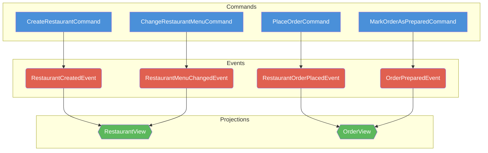

# Map Source Code to Event Model Table

Read TypeScript `DcbDecider` and `Projection` source files to extract commands,
events, and projections, then produce a Markdown table following the format
defined in the [map-event-model-to-code](../map-event-model-to-code/SKILL.md)
skill.

## Input

TypeScript source files containing:

- **Deciders** — each file exports a `DcbDecider<C, S, Ei, Eo>` where `C` is the
  command type and `Eo` is the output event type.
- **Views/Projections** — each file exports a `Projection<S, E>` whose event
  union type variants indicate which events it subscribes to.

## Output

A Markdown table + formulas + Mermaid diagram + Given/When/Then specifications,
all following [map-event-model-to-code](../map-event-model-to-code/SKILL.md)
rules.

## How to Extract

1. **Commands**: Find each decider's command type (the `C` type parameter of
   `DcbDecider`).
2. **Events (Eo)**: Find the output event type each decider produces (the `Eo`
   type parameter / return type of the `decide` function).
3. **Projections**: Find each `Projection<S, E>`. The event union type variants
   tell you which events it subscribes to.
4. **Timeline order**: Arrange commands left-to-right following the domain flow
   (creation → mutation → downstream actions).
5. **Repeated projections**: All primitives (C, E, P) are identified by name.
   When a projection appears multiple times (e.g. `B1 = D1`), only list the new
   event cell(s) from the immediately preceding command — earlier subscriptions
   are already captured in the previous occurrence.
6. **Given/When/Then specs**: For each decider, extract test scenarios from
   `Deno.test()` functions that use
   `DeciderEventSourcedSpec.for(decider).given().when().then()` /
   `.thenThrows()`. Include both success and error paths.

## Example: Restaurant Management Demo (dcb)

### Source → Cell Mapping

| Source File                      | Type | Name                                                                              |
| -------------------------------- | ---- | --------------------------------------------------------------------------------- |
| `createRestaurantDecider.ts`     | 🔵 C | CreateRestaurantCommand                                                           |
| `createRestaurantDecider.ts`     | 🟠 E | RestaurantCreatedEvent                                                            |
| `changeRestaurantMenuDecider.ts` | 🔵 C | ChangeRestaurantMenuCommand                                                       |
| `changeRestaurantMenuDecider.ts` | 🟠 E | RestaurantMenuChangedEvent                                                        |
| `placeOrderDecider.ts`           | 🔵 C | PlaceOrderCommand                                                                 |
| `placeOrderDecider.ts`           | 🟠 E | RestaurantOrderPlacedEvent                                                        |
| `markOrderAsPreparedDecider.ts`  | 🔵 C | MarkOrderAsPreparedCommand                                                        |
| `markOrderAsPreparedDecider.ts`  | 🟠 E | OrderPreparedEvent                                                                |
| `restaurantView.ts`              | 🟢 P | RestaurantView (subscribes to RestaurantCreatedEvent, RestaurantMenuChangedEvent) |
| `orderView.ts`                   | 🟢 P | OrderView (subscribes to RestaurantOrderPlacedEvent, OrderPreparedEvent)          |

### Resulting Table

|       | A                             | B                         | C                                 | D                         | E                                | F                    | G                                | H                    |
| ----- | ----------------------------- | ------------------------- | --------------------------------- | ------------------------- | -------------------------------- | -------------------- | -------------------------------- | -------------------- |
| Row 1 | 🔵 C: CreateRestaurantCommand | 🟢 P: RestaurantView [A2] | 🔵 C: ChangeRestaurantMenuCommand | 🟢 P: RestaurantView [C2] | 🔵 C: PlaceOrderCommand          | 🟢 P: OrderView [E2] | 🔵 C: MarkOrderAsPreparedCommand | 🟢 P: OrderView [G2] |
| Row 2 | 🟠 E: RestaurantCreatedEvent  |                           | 🟠 E: RestaurantMenuChangedEvent  |                           | 🟠 E: RestaurantOrderPlacedEvent |                      | 🟠 E: OrderPreparedEvent         |                      |

### Formulas

```
A1 = C(CreateRestaurantCommand)
A2 = E(RestaurantCreatedEvent)
B1 = P(RestaurantView)
C1 = C(ChangeRestaurantMenuCommand)
C2 = E(RestaurantMenuChangedEvent)
D1 = P(RestaurantView)
E1 = C(PlaceOrderCommand)
E2 = E(RestaurantOrderPlacedEvent)
F1 = P(OrderView)
G1 = C(MarkOrderAsPreparedCommand)
G2 = E(OrderPreparedEvent)
H1 = P(OrderView)

A1 -> [A2]              # CreateRestaurantCommand produces RestaurantCreatedEvent
C1 -> [C2]              # ChangeRestaurantMenuCommand produces RestaurantMenuChangedEvent
E1 -> [E2]              # PlaceOrderCommand produces RestaurantOrderPlacedEvent
G1 -> [G2]              # MarkOrderAsPreparedCommand produces OrderPreparedEvent

B1 <- [A2]              # RestaurantView subscribes to RestaurantCreatedEvent
D1 <- [C2]              # RestaurantView subscribes to RestaurantMenuChangedEvent
F1 <- [E2]              # OrderView subscribes to RestaurantOrderPlacedEvent
H1 <- [G2]              # OrderView subscribes to OrderPreparedEvent
```

### Mermaid Diagram

After producing the table and formulas, render a Mermaid diagram following the
[Mermaid Rendering Rules](../map-event-model-to-code/SKILL.md#rendering-rules):

1. Use `flowchart TD` with three `direction LR` subgraphs: `Commands` (top),
   `Events` (middle), `Projections` (bottom).
2. Node shapes: Commands → rectangles `[]`, Events → rounded `()`, Projections →
   hexagons `{{}}`. No C/E/P label prefixes needed — color + shape conveys the
   type.
3. Edges: Command `-->` Event (from `->` formulas), Event `-->` Projection (from
   `<-` formulas).
4. Repeated projections reuse the first node ID (e.g. `B1` for all
   `RestaurantView` occurrences).
5. Color nodes: Commands blue (`fill:#4A90D9`), Events red (`fill:#E06050`),
   Projections green (`fill:#5CB85C`).



### Given/When/Then Specifications

For each command, extract success and error scenarios from the decider tests.

#### CreateRestaurantCommand

**Scenario: Success — restaurant does not exist**

- Given: `[]`
- When: `{ kind: "CreateRestaurantCommand", restaurantId, name, menu }`
- Then:
  `[{ kind: "RestaurantCreatedEvent", restaurantId, name, menu, final: false, tagFields: ["restaurantId"] }]`

**Scenario: Error — restaurant already exists**

- Given: `[{ kind: "RestaurantCreatedEvent", restaurantId }]`
- When: `{ kind: "CreateRestaurantCommand", restaurantId, name, menu }`
- Then Error: `RestaurantAlreadyExistsError(restaurantId)`

#### ChangeRestaurantMenuCommand

**Scenario: Success — restaurant exists**

- Given: `[{ kind: "RestaurantCreatedEvent", restaurantId }]`
- When: `{ kind: "ChangeRestaurantMenuCommand", restaurantId, menu }`
- Then:
  `[{ kind: "RestaurantMenuChangedEvent", restaurantId, menu, final: false, tagFields: ["restaurantId"] }]`

**Scenario: Error — restaurant not found**

- Given: `[]`
- When: `{ kind: "ChangeRestaurantMenuCommand", restaurantId, menu }`
- Then Error: `RestaurantNotFoundError(restaurantId)`

#### PlaceOrderCommand

**Scenario: Success — restaurant exists, menu items available, new order**

- Given: `[{ kind: "RestaurantCreatedEvent", restaurantId, name, menu }]`
- When: `{ kind: "PlaceOrderCommand", restaurantId, orderId, menuItems }`
- Then:
  `[{ kind: "RestaurantOrderPlacedEvent", restaurantId, orderId, menuItems, final: false, tagFields: ["restaurantId", "orderId"] }]`

**Scenario: Error — restaurant not found**

- Given: `[]`
- When: `{ kind: "PlaceOrderCommand", restaurantId, orderId, menuItems }`
- Then Error: `RestaurantNotFoundError(restaurantId)`

**Scenario: Error — duplicate order**

- Given:
  `[{ kind: "RestaurantCreatedEvent" }, { kind: "RestaurantOrderPlacedEvent", orderId }]`
- When: `{ kind: "PlaceOrderCommand", restaurantId, orderId, menuItems }`
- Then Error: `OrderAlreadyExistsError(orderId)`

**Scenario: Error — menu items not available**

- Given: `[{ kind: "RestaurantCreatedEvent", menu }]`
- When:
  `{ kind: "PlaceOrderCommand", restaurantId, orderId, menuItems: [unavailableItem] }`
- Then Error: `MenuItemsNotAvailableError(unavailableMenuItemIds)`

#### MarkOrderAsPreparedCommand

**Scenario: Success — order is pending**

- Given: `[{ kind: "RestaurantOrderPlacedEvent", orderId }]`
- When: `{ kind: "MarkOrderAsPreparedCommand", orderId }`
- Then:
  `[{ kind: "OrderPreparedEvent", orderId, final: false, tagFields: ["orderId"] }]`

**Scenario: Error — order not found**

- Given: `[]`
- When: `{ kind: "MarkOrderAsPreparedCommand", orderId }`
- Then Error: `OrderNotFoundError(orderId)`

**Scenario: Error — order already prepared**

- Given:
  `[{ kind: "RestaurantOrderPlacedEvent", orderId }, { kind: "OrderPreparedEvent", orderId }]`
- When: `{ kind: "MarkOrderAsPreparedCommand", orderId }`
- Then Error: `OrderAlreadyPreparedError(orderId)`
