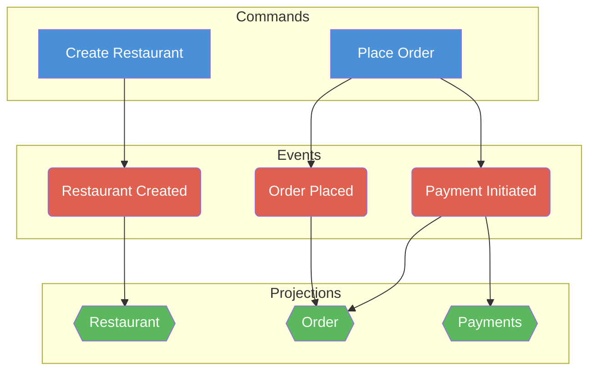

# Map Event Model to Code

A two-step pipeline: visual Event Model diagram → Markdown table → TypeScript code.

## Step 1: Diagram to Table

### Input

A visual Event Model diagram containing:
- **Commands** (blue sticky notes)
- **Events** (red/orange sticky notes)
- **Projections** (green sticky notes)

Arranged on a timeline from left to right.

### Cell Types

- **C** — Command (blue)
- **E** — Event (red/orange)
- **P** — Projection (green)

### Layout Rules

1. **Row 1** contains Commands and Projections. Row 2+ contains Events.
2. **Commands** occupy row 1 in their column. Events produced by that command stack vertically below it (row 2, row 3, …).
3. **Projections** sit in row 1, to the right of the event column(s) they subscribe to — placed between the current command's events and the next command.
4. Each **Projection cell** lists the event cells it subscribes to in brackets, e.g. `P: Restaurant [A2, A3]`.
5. **All primitives (C, E, P) are identified by name.** Projections can repeat across the timeline — repeated occurrences refer to the same projection (e.g. `B1 = D1` when both are `P: Restaurant`).
6. When a **projection repeats**, it only lists the new event cell(s) from the immediately preceding command — earlier subscriptions are already captured in the previous occurrence.
7. **Event columns** under a projection are empty — projections never share a column with events.

### Relationships

- **Command → Event(s)**: vertical (same column, row 1 → row 2, 3, …)
- **Event(s) → Projection**: horizontal (event column → next projection column to the right)
- A single command can produce multiple events.
- A single event can feed multiple projections (multiple P columns to its right before the next C column).
- Different events from the same command can feed different projections.

### Formula Notation

```
# Cell definitions
<cell> = <type>(<name>)

# Command produces events (vertical, downward)
<command_cell> -> [<event_cell>, ...]

# Projection subscribes to events (horizontal, from left)
<projection_cell> <- [<event_cell>, ...]
```

### Table Example

|       | A                      | B                  | C                      | D                  | E                 |
|-------|------------------------|--------------------|------------------------|--------------------|-------------------|
| Row 1 | C: Create Restaurant   | P: Restaurant [A2] | C: Place Order         | P: Order [C2, C3]  | P: Payments [C3]  |
| Row 2 | E: Restaurant Created  |                    | E: Order Placed        |                    |                   |
| Row 3 |                        |                    | E: Payment Initiated   |                    |                   |

### Formulas

```
A1 = C(Create Restaurant)
A2 = E(Restaurant Created)
B1 = P(Restaurant)
C1 = C(Place Order)
C2 = E(Order Placed)
C3 = E(Payment Initiated)
D1 = P(Order)
E1 = P(Payments)

A1 -> [A2]              # Create Restaurant produces Restaurant Created
C1 -> [C2, C3]          # Place Order produces Order Placed, Payment Initiated

B1 <- [A2]              # Restaurant subscribes to Restaurant Created
D1 <- [C2, C3]          # Order subscribes to Order Placed, Payment Initiated
E1 <- [C3]              # Payments subscribes to Payment Initiated
```

### Mermaid Diagram

Also render a Mermaid diagram from the formulas.

#### Rendering Rules

1. **Direction**: `flowchart TD` — top-down, commands at the top, events and projections below.
2. **Node shapes** (color makes C/E/P labels unnecessary):
   - **Command** → rectangle: `A1[Create Restaurant]`
   - **Event** → rounded: `A2(Restaurant Created)`
   - **Projection** → hexagon: `B1{{Restaurant}}`
3. **Edges follow natural direction**:
   - Each `->` formula becomes a Command `-->` Event edge.
   - Each `<-` formula becomes an Event `-->` Projection edge.
4. **Repeated projections reuse the same node ID** (first occurrence), e.g. `B1` and `D1` both map to `B1` if `B1 = D1`.
5. **Three horizontal subgraphs** with `direction LR`: `Commands` (top), `Events` (middle), `Projections` (bottom).
6. **Timeline order**: Commands listed left-to-right following the domain flow.
7. **Node colors**:
   - Commands: blue (`fill:#4A90D9,color:#fff`)
   - Events: red (`fill:#E06050,color:#fff`)
   - Projections: green (`fill:#5CB85C,color:#fff`)

#### Mermaid Example



## Step 2: Table to Code

### Output

TypeScript source files following the DCB (Dynamic Consistency Boundary) pattern:
- `api.ts` — shared domain types (IDs, entities, commands, events, errors)
- One `*Decider.ts` per command
- One `*View.ts` per projection
- One `*Decider_test.ts` per decider with Given/When/Then specs
- One `*View_test.ts` per view with Given/Then specs

### Code Generation Rules

#### 1. Shared API (`api.ts`)

From the table, generate:

- **Branded type IDs**: One branded type per unique ID field found in events, using the `Brand` utility:
  ```typescript
  type Brand<T, B> = T & { readonly __brand: B };
  export type RestaurantId = Brand<string, "RestaurantId">;
  export const restaurantId = (id: string): RestaurantId => id as RestaurantId;
  ```

- **Domain errors**: One `DomainError` base class and specific error subclasses derived from the `Then Error` lines in GWT specs:
  ```typescript
  export class DomainError extends Error {
    constructor(message: string) {
      super(message);
      this.name = this.constructor.name;
    }
  }
  export class RestaurantAlreadyExistsError extends DomainError {
    constructor(public readonly restaurantId: RestaurantId) {
      super(`Restaurant ${restaurantId} already exists`);
    }
  }
  ```

- **Command types**: Discriminated union using `kind` field:
  ```typescript
  export type Command = CreateRestaurantCommand | ChangeRestaurantMenuCommand;
  export type CreateRestaurantCommand = {
    readonly kind: "CreateRestaurantCommand";
    readonly restaurantId: RestaurantId;
    readonly name: RestaurantName;
    readonly menu: RestaurantMenu;
  };
  ```

- **Event types**: Using `TypeSafeEventShape` from `denoKvRepository.ts` with `tagFields` for indexing:
  ```typescript
  import type { TypeSafeEventShape } from "../../denoKvRepository.ts";

  export type Event = RestaurantCreatedEvent | RestaurantMenuChangedEvent;
  export type RestaurantCreatedEvent = TypeSafeEventShape<
    {
      readonly kind: "RestaurantCreatedEvent";
      readonly restaurantId: RestaurantId;
      readonly name: RestaurantName;
      readonly menu: RestaurantMenu;
      readonly final: boolean;
    },
    ["restaurantId"]
  >;
  ```

- **Shared value types**: Simple type aliases and object types for domain values:
  ```typescript
  export type RestaurantName = string;
  export type MenuItem = {
    readonly menuItemId: MenuItemId;
    readonly name: MenuItemName;
    readonly price: MenuItemPrice;
  };
  ```

#### 2. Decider files (one per command)

For each `->` formula (e.g. `A1 -> [A2]`):

```typescript
import { DcbDecider } from "../../decider.ts";
import { /* command type, event types, error classes */ } from "./api.ts";

// STATE — minimal state needed for the decide function's validation logic
type DeciderState = {
  readonly fieldA: TypeA | null;
  readonly fieldB: boolean;
};

// DECIDER — exported as a const
export const myDecider: DcbDecider<
  MyCommand,        // C  — command type
  DeciderState,     // S  — state type
  InputEvent,       // Ei — input event union (events needed to build state)
  OutputEvent       // Eo — output event type (events this decider produces)
> = new DcbDecider<MyCommand, DeciderState, InputEvent, OutputEvent>(
  (command, currentState) => {
    switch (command?.kind) {
      case "MyCommand": {
        // Validation logic derived from error scenarios
        if (!currentState.fieldA) {
          throw new NotFoundError(command.id);
        }
        // Produce output events
        return [{
          kind: "MyEvent",
          // ... fields from command
          final: false,
          tagFields: ["relevantIdField"],
        }];
      }
      default:
        return [];
    }
  },
  (currentState, event) => {
    switch (event?.kind) {
      case "RelevantInputEvent":
        return { /* evolved state */ };
      default:
        return currentState;
    }
  },
  { fieldA: null, fieldB: false },  // initial state
);
```

**Determining Ei (input events):**
- Find all events this decider needs to reconstruct state (from GWT `Given` lists)
- If all given events are the same type as Eo → `Ei = Eo` (simplest case)
- If given events include events from other deciders → create a union type `EventA | EventB | EventC`

**Determining State:**
- Derive from the error scenarios — each error implies a state check:
  - `AlreadyExists` → state tracks existence (`SomeId | null` or `boolean`)
  - `NotFound` → state tracks existence
  - `DuplicateDetection` → state tracks a `Set` or `boolean`
  - `ValidationError` → state tracks the data being validated (e.g. `RestaurantMenu | null`)

**Determining tagFields:**
- Events declare which string ID fields should be indexed via `tagFields`
- These correspond to the ID fields used in repository query tuples
- Typically: entity-scoped events use `["entityId"]`, cross-entity events use `["entityId1", "entityId2"]`

#### 3. Projection files (one per unique projection name)

For each unique P name, collect all `<-` formulas across the timeline:

```typescript
import { Projection } from "../../view.ts";
import type { /* event types, value types */ } from "./api.ts";

// VIEW — exported as a const
export const myView: Projection<MyViewState | null, MyViewEvent> =
  new Projection<MyViewState | null, MyViewEvent>(
    (currentState, event) => {
      switch (event.kind) {
        case "SomeEvent":
          return { /* build state from event */ };
        case "AnotherEvent":
          return currentState !== null
            ? { /* update existing state */ }
            : currentState;
        default: {
          const _exhaustiveCheck: never = event;
          return currentState;
        }
      }
    },
    null,  // initial state
  );

// Event union type for this view
type MyViewEvent = SomeEvent | AnotherEvent;

// View state type
export type MyViewState = {
  readonly fieldA: TypeA;
  readonly fieldB: TypeB;
};
```

**Key patterns:**
- Views use `Projection<S | null, E>` with `null` initial state
- First event typically creates the state, subsequent events update it
- Use exhaustive `switch` with `never` check in `default` branch
- Event union type is local to the view file (not exported from api.ts)

#### 4. Test files (one per decider, one per view)

**Decider tests** — one `Deno.test()` per GWT scenario:

```typescript
import { DeciderEventSourcedSpec } from "../../test_specification.ts";
import { myDecider } from "./myDecider.ts";
import {
  type MyCommand,
  myId,
  MyNotFoundError,
  type MyMenu,
  myMenuId,
} from "./api.ts";

// Reusable test data
const testMenu: MyMenu = {
  menuId: myMenuId("menu-1"),
  // ... fields
};

Deno.test("My Command - Success", () => {
  DeciderEventSourcedSpec.for(myDecider)
    .given([/* input events */])
    .when({
      kind: "MyCommand",
      // ... command fields
    })
    .then([{
      kind: "MyOutputEvent",
      // ... expected event fields
      final: false,
      tagFields: ["relevantId"],
    }]);
});

Deno.test("My Command - Not Found Error", () => {
  DeciderEventSourcedSpec.for(myDecider)
    .given([])
    .when({
      kind: "MyCommand",
      // ... command fields
    })
    .thenThrows((error) => error instanceof MyNotFoundError);
});
```

**View tests** — using `ViewSpecification`:

```typescript
import { ViewSpecification } from "../../test_specification.ts";
import { myView } from "./myView.ts";
import { myId, type MyMenu, myMenuId } from "./api.ts";

Deno.test("My View - Build State from Events", () => {
  ViewSpecification.for(myView)
    .given([
      {
        kind: "SomeEvent",
        // ... event fields
      },
      {
        kind: "AnotherEvent",
        // ... event fields
      },
    ])
    .then({
      // ... expected view state
    });
});
```

#### 5. Naming Conventions

| Artifact | File Name | Export Name |
|---|---|---|
| Decider | `camelCaseDecider.ts` | `camelCaseDecider` |
| Decider test | `camelCaseDecider_test.ts` | — |
| View/Projection | `camelCaseView.ts` | `camelCaseView` |
| View test | `camelCaseView_test.ts` | — |
| Shared types | `api.ts` | named exports |
| View state type | in view file | `PascalCaseView` |
| Decider state type | in decider file | `PascalCaseState` (not exported) |
