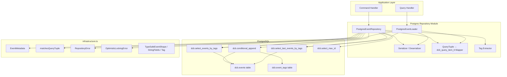
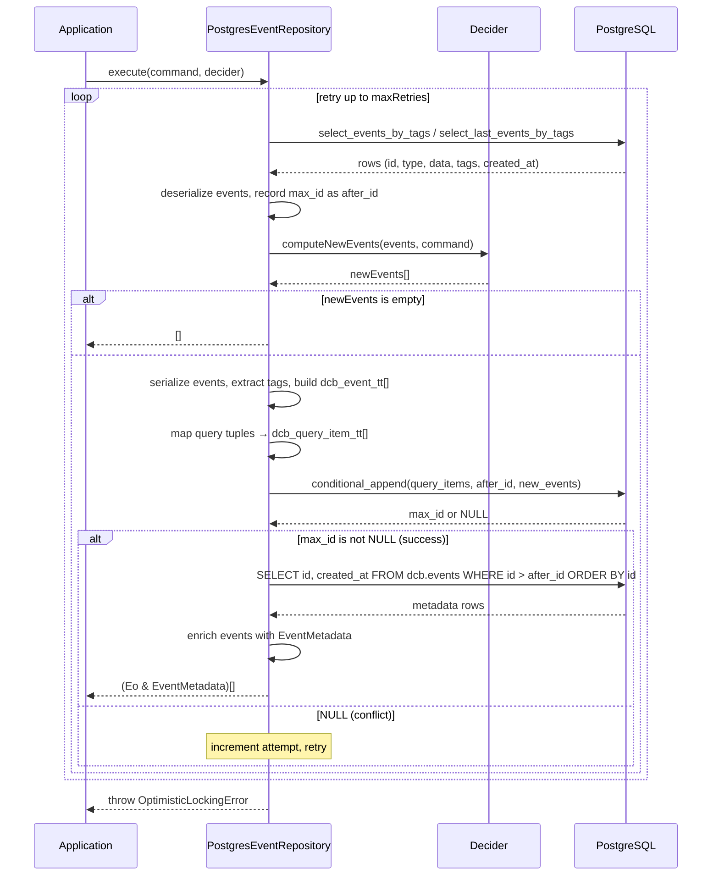

# Design Document: postgres-event-repository

## Overview

This design describes a `PostgresEventRepository` class and a standalone
`PostgresEventLoader` class that implement the existing `IEventRepository` and
`IEventLoader` interfaces (from `application.ts`) backed by PostgreSQL. The
implementation delegates all storage, indexing, and conflict detection to
predefined SQL functions in the `dcb` schema, communicating via the
`@bartlomieju/postgres` JSR client.

The Postgres repository mirrors the `DenoKvEventRepository` API surface — same
generic type parameters, same `execute`/`executeBatch`/`load` methods, same
factory-function construction pattern — so that switching from Deno KV to
Postgres requires only swapping the repository instance. The key architectural
difference is that optimistic locking uses an integer `after_id` (the max event
id at load time) instead of Deno KV versionstamps, and all atomicity is handled
server-side by `dcb.conditional_append`.

### Key Design Decisions

1. **Extract shared infrastructure** — Types and utilities shared between
   repository implementations are extracted into a new `infrastructure.ts` file
   at the project root. This includes `EventMetadata`, `RepositoryError`,
   `OptimisticLockingError`, `matchesQueryTuple`, `Tag`, `StringFields`, and
   `TypeSafeEventShape`. Both `denoKvEventRepository.ts` and
   `postgresEventRepository.ts` import from `infrastructure.ts`. The
   `denoKvEventRepository.ts` re-exports these types for backward compatibility.

2. **Delegate to SQL functions** — The repository does not construct raw
   INSERT/SELECT statements. It calls `dcb.conditional_append`,
   `dcb.select_events_by_tags`, `dcb.select_last_events_by_tags`, and
   `dcb.select_max_id` via parameterized queries. This keeps the TypeScript
   layer thin and pushes correctness guarantees into the database.

3. **Serializer/Deserializer injection** — Events are stored as `bytea`. The
   repository accepts a `Serializer` (event → `Uint8Array`) and `Deserializer`
   (`Uint8Array` → event) at construction time, with default JSON-based
   implementations exported from the module.

4. **Reuse shared infrastructure** — `matchesQueryTuple`, `RepositoryError`,
   `OptimisticLockingError`, and `EventMetadata` are imported from
   `infrastructure.ts`. The `versionstamp` field in `EventMetadata` is populated
   with the stringified bigserial `id` from Postgres, serving as the
   version/position marker.

5. **Single file** — Both `PostgresEventRepository` and `PostgresEventLoader`
   live in `postgresEventRepository.ts` at the project root, alongside
   `denoKvEventRepository.ts`.

## Architecture



### Execution Flow — Single Command



## Components and Interfaces

### EventMetadata (extracted to infrastructure.ts)

The `EventMetadata` interface is extracted from `denoKvEventRepository.ts` into
a new `infrastructure.ts` file, along with other shared types. Both repository
implementations import from `infrastructure.ts`. The `denoKvEventRepository.ts`
re-exports these types for backward compatibility.

```typescript
// infrastructure.ts — shared across repository implementations
export interface EventMetadata {
  readonly eventId: string; // string representation of bigserial id (Postgres) or ULID (Deno KV)
  readonly timestamp: number; // Unix timestamp ms from created_at (Postgres) or Date.now() (Deno KV)
  readonly versionstamp: string; // string representation of bigserial id (Postgres) or KV versionstamp (Deno KV)
}
```

**Types extracted to `infrastructure.ts`:**

- `EventMetadata` — metadata interface
- `RepositoryError` — error class for load/persist failures
- `OptimisticLockingError` — error class for retry exhaustion
- `matchesQueryTuple` — batch event filtering utility
- `Tag` — `"fieldName:fieldValue"` string type alias
- `StringFields<E>` — mapped type for extracting string field names
- `TypeSafeEventShape` — type-safe event with constrained tagFields

### Serializer / Deserializer Types

```typescript
export type Serializer<E> = (event: E) => Uint8Array;
export type Deserializer<E> = (data: Uint8Array) => E;
```

### Default JSON Serializer and Deserializer

```typescript
export const defaultSerializer: Serializer<unknown> = (event) =>
  new TextEncoder().encode(JSON.stringify(event));

export const defaultDeserializer: Deserializer<unknown> = (data) =>
  JSON.parse(new TextDecoder().decode(data));
```

### PostgresEventRepository

```typescript
export class PostgresEventRepository<
  C extends CommandShape,
  Ei extends EventShape,
  Eo extends EventShape,
> implements
  IEventRepository<C, Ei, Eo, Record<PropertyKey, never>, EventMetadata> {
  constructor(
    private readonly client: Client,
    private readonly getQueryTuples: (command: C) => QueryTuple<Ei>[],
    private readonly maxRetries: number = 10,
    private readonly idempotent: boolean = true,
    private readonly serializer: Serializer<Eo> = defaultSerializer,
    private readonly deserializer: Deserializer<Ei> = defaultDeserializer,
  ) {}

  execute(
    command: C,
    decider: IEventComputation<C, Ei, Eo>,
  ): Promise<readonly (Eo & EventMetadata)[]>;

  executeBatch(
    commands: readonly C[],
    decider: IEventComputation<C, Ei, Eo>,
  ): Promise<readonly (Eo & EventMetadata)[]>;

  load(queryTuples: QueryTuple<Ei>[]): Promise<readonly Ei[]>;
}
```

### PostgresEventLoader

```typescript
export class PostgresEventLoader<Ei extends EventShape>
  implements IEventLoader<Ei> {
  constructor(
    private readonly client: Client,
    private readonly deserializer: Deserializer<Ei> = defaultDeserializer,
    private readonly idempotent: boolean = true,
  ) {}

  load(queryTuples: QueryTuple<Ei>[]): Promise<readonly Ei[]>;
}
```

### Internal Helper: mapQueryTuplesToSql

Converts `QueryTuple<Ei>[]` into the SQL literal representation of
`dcb_query_item_tt[]` for use in parameterized queries.

```typescript
function mapQueryTuplesToSql<Ei extends EventShape>(
  queryTuples: QueryTuple<Ei>[],
): string;
```

Each `QueryTuple` `[...tags, eventType]` maps to a `dcb_query_item_tt`:

- `types`: `ARRAY[eventType]::text[]` (single-element array)
- `tags`: `ARRAY[tag1, tag2, ...]::text[]` (all elements except last)

Example: `["restaurantId:r1", "RestaurantCreatedEvent"]` →
`ROW(ARRAY['RestaurantCreatedEvent'], ARRAY['restaurantId:r1'])::dcb.dcb_query_item_tt`

### Internal Helper: extractTags

Reuses the same tag extraction logic as `DenoKvEventRepository` — iterates
`tagFields`, formats as `"fieldName:fieldValue"`, skips undefined/null/empty.

```typescript
function extractTags<Eo extends EventShape>(event: Eo): string[];
```

### Internal Helper: buildEventTuples

Converts output events into the SQL literal representation of `dcb_event_tt[]`.

```typescript
function buildEventTuples<Eo extends EventShape>(
  events: readonly Eo[],
  serializer: Serializer<Eo>,
): string;
```

Each event maps to:
`ROW(event.kind, serializedBytes, ARRAY[tags])::dcb.dcb_event_tt`

## Data Models

### PostgreSQL Schema (existing, not created by this feature)

**`dcb.events` table:**

| Column     | Type        | Description                                |
| ---------- | ----------- | ------------------------------------------ |
| id         | bigserial   | Primary key, auto-incrementing             |
| type       | text        | Event kind/type                            |
| data       | bytea       | Serialized event payload                   |
| tags       | text[]      | Tag array in "fieldName:fieldValue" format |
| created_at | timestamptz | Server-assigned timestamp                  |

**`dcb.event_tags` junction table:**

| Column  | Type   | Description          |
| ------- | ------ | -------------------- |
| tag     | text   | Individual tag value |
| main_id | bigint | FK to dcb.events.id  |

**Composite types:**

- `dcb.dcb_event_tt(type text, data bytea, tags text[])` — used to pass events
  to append functions
- `dcb.dcb_query_item_tt(types text[], tags text[])` — used to pass query specs
  to read/append functions

### TypeScript Types

```typescript
// Imported from infrastructure.ts
// EventMetadata { eventId: string, timestamp: number, versionstamp: string }
// RepositoryError, OptimisticLockingError, matchesQueryTuple, Tag, StringFields, TypeSafeEventShape

// Serialization functions (defined in postgresEventRepository.ts)
export type Serializer<E> = (event: E) => Uint8Array;
export type Deserializer<E> = (data: Uint8Array) => E;
```

### Query Tuple → SQL Mapping

| QueryTuple                                              | dcb_query_item_tt.types      | dcb_query_item_tt.tags              |
| ------------------------------------------------------- | ---------------------------- | ----------------------------------- |
| `["RestaurantCreatedEvent"]`                            | `['RestaurantCreatedEvent']` | `[]`                                |
| `["restaurantId:r1", "RestaurantCreatedEvent"]`         | `['RestaurantCreatedEvent']` | `['restaurantId:r1']`               |
| `["restaurantId:r1", "orderId:o1", "OrderPlacedEvent"]` | `['OrderPlacedEvent']`       | `['restaurantId:r1', 'orderId:o1']` |

### Event → dcb_event_tt Mapping

| Event field              | dcb_event_tt field | Transformation                              |
| ------------------------ | ------------------ | ------------------------------------------- |
| `event.kind`             | `type`             | Direct string                               |
| `event` (whole object)   | `data`             | `serializer(event)` → bytea                 |
| `event.tagFields` values | `tags`             | Extract as `"fieldName:fieldValue"` strings |

## Correctness Properties

_A property is a characteristic or behavior that should hold true across all
valid executions of a system — essentially, a formal statement about what the
system should do. Properties serve as the bridge between human-readable
specifications and machine-verifiable correctness guarantees._

### Property 1: QueryTuple to dcb_query_item_tt mapping preserves structure

_For any_ array of QueryTuples, where each tuple has one or more elements,
mapping them to `dcb_query_item_tt[]` SHALL produce an array of the same length
where, for each entry, the `types` field contains exactly the last element of
the corresponding tuple and the `tags` field contains all preceding elements in
order.

**Validates: Requirements 5.1, 5.2, 5.3**

### Property 2: Default JSON serialization round-trip

_For any_ valid event object containing JSON-serializable values (strings,
numbers, booleans, arrays, nested objects, null), applying `defaultSerializer`
followed by `defaultDeserializer` SHALL produce an object deeply equal to the
original event.

**Validates: Requirements 6.3, 12.3**

### Property 3: Tag extraction produces correct "fieldName:fieldValue" format

_For any_ event object with a `tagFields` array declaring string-typed field
names, extracting tags SHALL produce an array where each element is formatted as
`"fieldName:fieldValue"` using the actual field name and its string value from
the event, and fields with undefined, null, or empty string values are excluded.

**Validates: Requirements 8.1, 8.2, 8.3**

## Error Handling

### Error Categories

| Error Type                                      | When Thrown                                                            | Wrapping Behavior                   |
| ----------------------------------------------- | ---------------------------------------------------------------------- | ----------------------------------- |
| `RepositoryError("load", cause)`                | Database failure during event loading (select queries)                 | Wraps the original database error   |
| `RepositoryError("persist", cause)`             | Database failure during event persistence (excluding conflict NULL)    | Wraps the original database error   |
| `OptimisticLockingError(attempts, entityId)`    | `conditional_append` returns NULL and retry count exceeds `maxRetries` | Standalone error with attempt count |
| Domain errors (e.g., `RestaurantNotFoundError`) | Decider throws during `computeNewEvents`                               | Propagated directly, never wrapped  |

### Error Handling Strategy

1. **Database errors during load**: Catch any error from `select_events_by_tags`
   / `select_last_events_by_tags` / `select_max_id` and wrap in
   `RepositoryError` with operation `"load"`.

2. **Database errors during persist**: Catch any error from `conditional_append`
   (other than the expected NULL return for conflicts) and wrap in
   `RepositoryError` with operation `"persist"`.

3. **Conflict detection**: A NULL return from `conditional_append` is not an
   error — it signals a conflict. The repository increments the retry counter
   and re-enters the load-decide-persist loop.

4. **Domain errors**: Errors thrown by `decider.computeNewEvents()` propagate
   immediately. The repository does not catch, wrap, or retry domain errors.
   This ensures domain validation failures (e.g., `RestaurantNotFoundError`,
   `OrderAlreadyExistsError`) reach the caller with their original type and
   message.

5. **Batch error handling**: If a domain error occurs mid-batch, no events from
   the batch are persisted (since persistence only happens after all commands
   are processed). The error propagates immediately.

## Testing Strategy

### Dual Testing Approach

This feature uses both unit tests and property-based tests for comprehensive
coverage.

### Property-Based Tests

Property-based testing is appropriate for the pure functions in this module:
query tuple mapping, serialization round-trip, and tag extraction. These are
pure functions with clear input/output behavior and large input spaces.

**Library**: [fast-check](https://github.com/dubzzz/fast-check) via
`npm:fast-check` (compatible with Deno)

**Configuration**: Minimum 100 iterations per property test.

**Tag format**:
`Feature: postgres-event-repository, Property {number}: {property_text}`

| Property                       | Test                                                                                                                              | Validates         |
| ------------------------------ | --------------------------------------------------------------------------------------------------------------------------------- | ----------------- |
| Property 1: QueryTuple mapping | Generate random QueryTuples with 1–5 elements, verify mapping structure                                                           | Req 5.1, 5.2, 5.3 |
| Property 2: JSON round-trip    | Generate random JSON-serializable objects with `kind` field, verify `defaultDeserializer(defaultSerializer(obj))` equals original | Req 6.3, 12.3     |
| Property 3: Tag extraction     | Generate random events with `tagFields` (including edge cases: missing fields, null, empty), verify output format                 | Req 8.1, 8.2, 8.3 |

### Unit Tests (Example-Based)

Unit tests cover specific scenarios, edge cases, and error conditions:

| Category                        | Tests                                                                 |
| ------------------------------- | --------------------------------------------------------------------- |
| Constructor                     | Default parameters, custom parameters, custom serializer/deserializer |
| Empty batch                     | `executeBatch([])` returns `[]` without queries                       |
| Zero events                     | `execute` returns `[]` when decider produces no events                |
| Domain error propagation        | Decider throws → error propagates unwrapped                           |
| Default serializer/deserializer | Specific known inputs produce expected outputs                        |

### Integration Tests (Require Running PostgreSQL)

Integration tests verify the full repository behavior against a real PostgreSQL
instance with the `dcb` schema:

| Category                  | Tests                                                          |
| ------------------------- | -------------------------------------------------------------- |
| Single command execution  | Happy path: load → decide → persist → return with metadata     |
| Batch command execution   | Multiple commands with accumulated event propagation           |
| Optimistic locking        | Conflict detection and retry via `conditional_append` NULL     |
| Max retry exhaustion      | `OptimisticLockingError` thrown after `maxRetries`             |
| Idempotent vs full-replay | `select_last_events_by_tags` vs `select_events_by_tags`        |
| Event ordering            | Events returned sorted by `id` ascending                       |
| Metadata enrichment       | `eventId`, `timestamp`, and `versionstamp` correctly populated |
| Error wrapping            | Database failures wrapped in `RepositoryError`                 |
| PostgresEventLoader       | Standalone loader with both idempotent modes                   |

### Test File Organization

- `postgresEventRepository_test.ts` — All tests (property, unit, integration)
- Integration tests gated behind an environment variable or Deno test filter to
  avoid requiring a running Postgres instance for basic test runs
