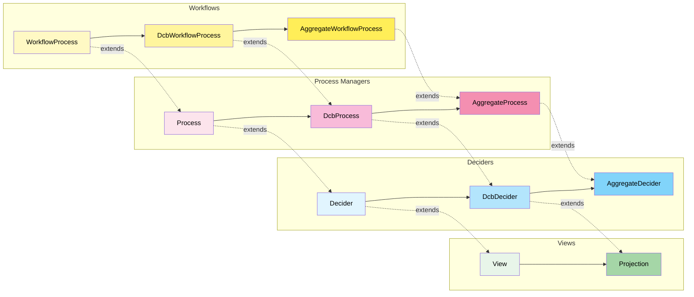
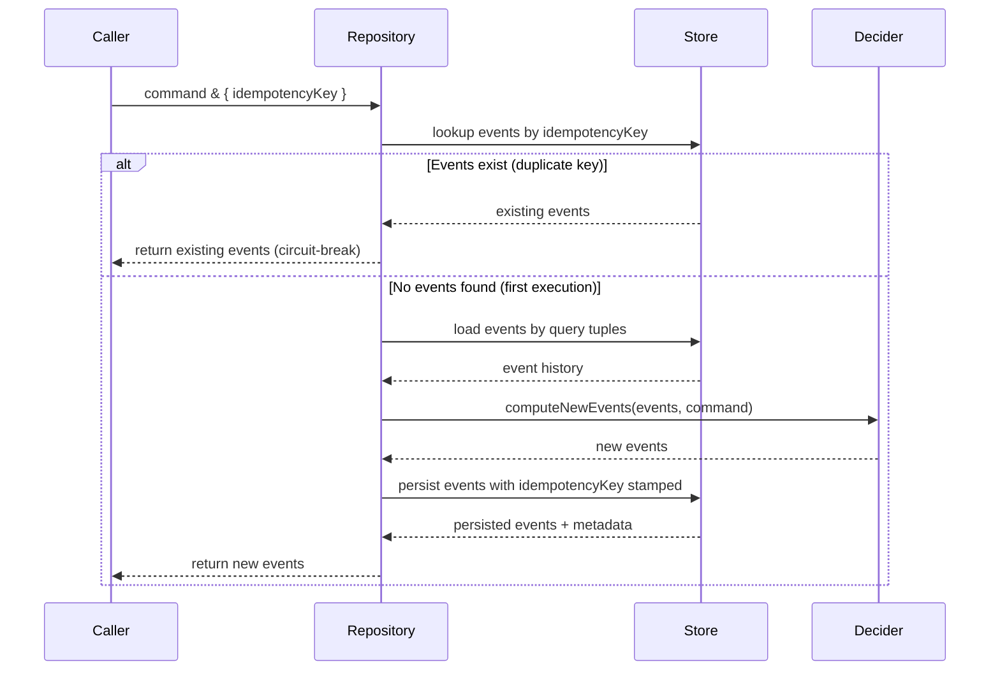

# fmodel-decider

**A spec-driven development framework** where the type system provides formal
constraints and the Given-When-Then DSL provides executable examples — together
forming a powerful foundation for building correct systems with AI assistance.

TypeScript library for modeling deciders (`command handlers`), process managers,
and views (`event handlers`) in domain-driven, event-sourced, or state-stored
architectures with progressive type refinement.


## Why fmodel-decider?

- **Type System as Specification**: Interfaces like `IDcbDecider` and
  `IAggregateDecider` are executable specifications that constrain
  implementations and guide AI code generation
- **Given-When-Then as Executable Examples**: Tests are specifications by
  example that serve as living documentation and formal requirements
- **Progressive Refinement**: Start with flexible types, add constraints
  incrementally as requirements clarify
- **AI-Friendly**: Formal types and concrete examples reduce hallucinations and
  guide AI tools to generate correct implementations
- **Production-Ready Infrastructure**: Complete event-sourced repositories
  (event stores) with Deno KV and PostgreSQL, optimistic locking, and flexible
  querying

## Table of Contents

- [Why fmodel-decider?](#why-fmodel-decider)
- [Spec-Driven Development](#spec-driven-development)
  - [Type System as Formal Specification](#type-system-as-formal-specification)
  - [Given-When-Then as Executable Examples](#given-when-then-as-executable-examples)
  - [The Workflow: From Vibing to Viable](#the-workflow-from-vibing-to-viable)
- [Core Abstractions](#core-abstractions)
- [Progressive Type Refinement](#progressive-type-refinement)
  - [Computation Patterns](#computation-patterns)
  - [Deciders](#deciders)
  - [Views](#views)
  - [Process Managers](#process-managers)
- [Application Layer](#application-layer)
  - [Repository Interfaces](#repository-interfaces)
  - [Command & Event Handlers](#command--event-handlers)
- [Batch Command Execution](#batch-command-execution)
  - [Why Batch?](#why-batch)
  - [How It Works](#how-it-works)
  - [Accumulated Event Propagation](#accumulated-event-propagation)
  - [API](#api)
- [Deno KV Event-Sourced Repository (Event Store)](#deno-kv-event-sourced-repository-event-store)
  - [Architecture](#architecture)
  - [Tuple-Based Query Pattern](#tuple-based-query-pattern)
  - [Type-Safe Tag Configuration](#type-safe-tag-configuration)
  - [Tag Subset Generation & Write Amplification](#tag-subset-generation--write-amplification)
  - [Optimistic Locking](#optimistic-locking)
  - [Concrete Repository Example](#concrete-repository-example)
- [Idempotent Mode (Last-Event Optimization)](#idempotent-mode-last-event-optimization)
  - [Read Optimization](#read-optimization)
  - [Downstream Idempotency](#downstream-idempotency)
  - [Snapshot-Style vs. Accumulation-Style Events](#snapshot-style-vs-accumulation-style-events)
- [PostgreSQL Event-Sourced Repository (Event Store)](#postgresql-event-sourced-repository-event-store)
  - [Schema Architecture](#schema-architecture)
  - [SQL Functions](#sql-functions)
  - [Optimistic Locking (PostgreSQL)](#optimistic-locking-1)
  - [Composite Types](#composite-types)
  - [Tuple-Based Query Pattern (PostgreSQL)](#tuple-based-query-pattern-1)
  - [Concrete Repository Example (PostgreSQL)](#concrete-repository-example-1)
  - [Metadata Mapping](#metadata-mapping)
  - [Event Serialization](#event-serialization)
- [Idempotency Key](#idempotency-key)
  - [How It Works](#how-it-works)
  - [CommandMetadata & EventMetadata](#commandmetadata--eventmetadata)
  - [Usage](#usage)
  - [Decider Purity](#decider-purity)
  - [Race Condition Safety](#race-condition-safety)
  - [Batch Execution](#batch-execution)
- [Demo: Restaurant & Order Management](#demo-restaurant--order-management)
  - [Scenario 1: Aggregate Pattern](#scenario-1-aggregate-pattern-demoaggregate)
  - [Scenario 2: Dynamic Consistency Boundary](#scenario-2-dynamic-consistency-boundary-demodcb)
  - [Comparison](#comparison)
  - [Running the Demos](#running-the-demos)
- [Testing](#testing)
- [Development](#development)
- [Publish to JSR (dry run)](#publish-to-jsr-dry-run)
- [Further Reading](#further-reading)
- [Credits](#credits)

## Spec-Driven Development

fmodel-decider positions **specification as code** through two complementary
mechanisms:

### Type System as Formal Specification

The type hierarchy encodes domain modeling patterns as executable
specifications:

```ts
// Formal specification: Event-sourced computation
interface IEventComputation<C, Ei, Eo> {
  computeNewEvents(events: readonly Ei[], command: C): readonly Eo[];
}

// Formal specification: Dynamic consistency boundary
interface IDcbDecider<C, S, Ei, Eo>
  extends IDecider<C, S, S, Ei, Eo>, IEventComputation<C, Ei, Eo> {}
```

### Given-When-Then as Executable Examples

Tests are specifications by example that formally define behavior:

```ts
// "Given a restaurant exists, when placing an order, then order placed event is produced"
DeciderEventSourcedSpec.for(placeOrderDecider)
  .given([restaurantCreatedEvent])
  .when(placeOrderCommand)
  .then([restaurantOrderPlacedEvent]);

// "Given no restaurant exists, when placing an order, then throw error"
DeciderEventSourcedSpec.for(placeOrderDecider)
  .given([])
  .when(placeOrderCommand)
  .thenThrows((error) => error instanceof RestaurantNotFoundError);
```

Three specification formats are available:

| Format                    | Purpose                         | Compatible With                    |
| ------------------------- | ------------------------------- | ---------------------------------- |
| `DeciderEventSourcedSpec` | Event-sourced decider behavior  | `IDcbDecider`, `IAggregateDecider` |
| `DeciderStateStoredSpec`  | State-stored aggregate behavior | `IAggregateDecider` only           |
| `ViewSpecification`       | View/projection behavior        | `IProjection`                      |

The Given-When-Then DSL is runtime-agnostic. It depends on an `Assertions`
interface (just `assertEquals` and `assert`) rather than a specific test
framework. Call `createSpecs(assertions)` to wire your own assertion library and
get back all three spec builders. For Deno, a pre-wired adapter is provided in
`test_specification_deno.ts`; for Vitest, Jest, or Node's built-in assert,
create an equivalent adapter file (see JSDoc on `createSpecs` for examples).

### The Workflow: From Vibing to Viable

1. **Define types** (formal specification) → constrain the solution space
2. **Write Given-When-Then tests** (executable examples) → specify behavior
3. **Implement with AI assistance** (guided by specs) → generate correct code
4. **Verify and deploy** (type system + tests) → confidence in correctness

## Core Abstractions

| Abstraction           | Role                                                                 |
| --------------------- | -------------------------------------------------------------------- |
| **Decider**           | Pure functional command handler — decides events, evolves state      |
| **View / Projection** | Event-sourced read model — builds state from event streams           |
| **Process Manager**   | Orchestration — coordinates long-running workflows (smart ToDo list) |
| **Workflow Process**  | Specialized process manager with task-based state management         |

## Progressive Type Refinement

The library evolves from **general, flexible types** to **specific, constrained
types**. Each refinement step increases semantic meaning, eliminates impossible
states, and enables new capabilities.



### Computation Patterns

| Interface          | Purpose                                    | Method             |
| ------------------ | ------------------------------------------ | ------------------ |
| `EventComputation` | Event-sourced (replay events → new events) | `computeNewEvents` |
| `StateComputation` | State-stored (current state → new state)   | `computeNewState`  |

### Deciders

| Type                         | Constraint                   | Computation Mode             |
| ---------------------------- | ---------------------------- | ---------------------------- |
| `Decider<C, Si, So, Ei, Eo>` | All independent              | Generic                      |
| `DcbDecider<C, S, Ei, Eo>`   | `Si = So = S`                | Event-sourced                |
| `AggregateDecider<C, S, E>`  | `Si = So = S`, `Ei = Eo = E` | Event-sourced + State-stored |

### Views

| Type               | Constraint      | Computation Mode |
| ------------------ | --------------- | ---------------- |
| `View<Si, So, E>`  | All independent | Generic          |
| `Projection<S, E>` | `Si = So = S`   | State-stored     |

### Process Managers

| Type                             | Constraint                   | Computation Mode             |
| -------------------------------- | ---------------------------- | ---------------------------- |
| `Process<AR, Si, So, Ei, Eo, A>` | All independent              | Generic                      |
| `DcbProcess<AR, S, Ei, Eo, A>`   | `Si = So = S`                | Event-sourced                |
| `AggregateProcess<AR, S, E, A>`  | `Si = So = S`, `Ei = Eo = E` | Event-sourced + State-stored |

## Application Layer

The application layer bridges pure domain logic with infrastructure. Its key
principle is **metadata isolation** — domain logic stays pure and metadata-free,
with correlation IDs, timestamps, and versions added at the boundary.

```ts
// Domain layer — pure, no metadata
const orderDecider: IDcbDecider<
  OrderCommand,
  OrderState,
  OrderEvent,
  OrderEvent
>;

// Application layer — metadata introduced here
const handler = new EventSourcedCommandHandler(orderDecider, repository);
const events = await handler.handle(command); // Single command
const batchEvents = await handler.handleBatch(commands); // Atomic batch
```

### Repository Interfaces

```ts
// Event-sourced: command + metadata → events + metadata
interface IEventRepository<C, Ei, Eo, CM, EM> {
  execute(
    command: C & CM,
    decider: IEventComputation<C, Ei, Eo>,
  ): Promise<readonly (Eo & EM)[]>;

  executeBatch(
    commands: readonly (C & CM)[],
    decider: IEventComputation<C, Ei, Eo>,
  ): Promise<readonly (Eo & EM)[]>;
}

// State-stored: command + metadata → state + metadata
interface IStateRepository<C, S, CM, SM> {
  execute(command: C & CM, decider: IStateComputation<C, S>): Promise<S & SM>;

  executeBatch(
    commands: readonly (C & CM)[],
    decider: IStateComputation<C, S>,
  ): Promise<S & SM>;
}

// View state: event + metadata → state + metadata
interface IViewStateRepository<E, S, EM, SM> {
  execute(event: E & EM, view: IProjection<S, E>): Promise<S & SM>;
}
```

### Command & Event Handlers

| Handler                      | Bridges                      | Compatible With                    |
| ---------------------------- | ---------------------------- | ---------------------------------- |
| `EventSourcedCommandHandler` | Decider ↔ Event Repository   | `IDcbDecider`, `IAggregateDecider` |
| `StateStoredCommandHandler`  | Decider ↔ State Repository   | `IAggregateDecider` only           |
| `EventHandler`               | View ↔ View State Repository | `IProjection`                      |

All command handlers also expose `handleBatch(commands)` alongside the existing
`handle(command)` method. See
[Batch Command Execution](#batch-command-execution) for details.

## Batch Command Execution

Process an ordered list of commands within a single atomic transaction. Events
produced by earlier commands in the batch are visible to subsequent commands via
accumulated event propagation, filtered through each command's query tuples.

### Why Batch?

Multi-command workflows like "create a restaurant then immediately place an
order" normally require separate round-trips. With batch execution, the entire
sequence runs atomically — no intermediate persistence, no risk of partial
completion.

```ts
// Single atomic batch: CreateRestaurant + PlaceOrder
const events = await handler.handleBatch([
  createRestaurantCommand,
  placeOrderCommand, // sees RestaurantCreatedEvent from above
]);
// → [RestaurantCreatedEvent, RestaurantOrderPlacedEvent]
```

#### Replacing the Saga pattern

When multiple commands need to succeed or fail together, the traditional answer
is a Saga — a choreography of compensating actions across separate transactions.
Sagas add significant complexity: you need compensation handlers, failure
tracking, and eventual consistency reasoning. Batch execution eliminates all of
that for cases where the commands share an event store. One atomic transaction,
one success-or-failure outcome, no compensations to design.

#### Composing multiple operations atomically

Consider a money transfer modeled as a single `TransferCommand` that debits one
account and credits another. Now imagine you need to execute several transfers
at once — payroll, settlement, rebalancing. Without batching, each transfer is a
separate transaction, and a failure mid-way leaves the system in a partially
applied state. With `handleBatch`, all transfers execute in a single atomic
commit:

```ts
// All-or-nothing: three transfers in one transaction
const events = await handler.handleBatch([
  transferCommand1, // Account A → Account B
  transferCommand2, // Account C → Account B
  transferCommand3, // Account E → Account B  (sees effects of transfers 1 & 2)
]);
```

Each subsequent transfer sees the events produced by earlier ones through
accumulated event propagation — so balance checks, limit validations, and
cross-account invariants all operate on the correct in-flight state. If any
transfer fails its domain rules, the entire batch rolls back. No partial
application, no compensating transactions, no Saga infrastructure.

### How It Works

**Event-sourced batches:**

1. Load events once (using the first command's query tuples)
2. Process each command sequentially — accumulated events from earlier commands
   are filtered by the current command's query tuples and appended to the loaded
   history
3. Persist all produced events in a single atomic operation
4. On optimistic locking conflict, retry the entire batch

**State-stored batches:**

1. Load current state once
2. Process each command sequentially — output state feeds into the next command
3. Persist only the final state atomically

### Accumulated Event Propagation

The key mechanism: when processing command N, the repository filters all events
produced by commands 1..N-1 through command N's query tuples. Only matching
events are appended to the loaded history for state derivation.

```ts
// Query tuple filter match:
// An accumulated event matches a tuple [...tags, eventType] iff:
//   event.kind === eventType AND
//   every tag "fieldName:fieldValue" matches event[fieldName]
```

This means a `PlaceOrderCommand` for restaurant "r1" will see the
`RestaurantCreatedEvent` for "r1" from an earlier command in the same batch, but
not a `RestaurantCreatedEvent` for "r2".

### API

All batch methods are additive — existing `handle`/`execute` signatures are
unchanged.

```ts
// Command handlers
handler.handleBatch(commands: readonly (C & CM)[]): Promise<readonly (Eo & EM)[]>  // event-sourced
handler.handleBatch(commands: readonly (C & CM)[]): Promise<S & SM>                // state-stored

// Repository interfaces
repository.executeBatch(commands, decider): Promise<readonly (Eo & EM)[]>  // event-sourced
repository.executeBatch(commands, decider): Promise<S & SM>                // state-stored
```

## Deno KV Event-Sourced Repository (Event Store)

Production-ready event-sourced repository using Deno KV with optimistic locking,
flexible querying, and type-safe tag-based indexing.

### Architecture

```
Primary Storage:           ["events", eventId] → full event data
Secondary Tag Index:       ["events_by_type", eventType, ...tags, eventId] → eventId (pointer)
Last Event Pointer Index:  ["last_event", eventType, ...tags] → eventId (mutable pointer)
```

- Event data stored once; secondary indexes store only ULID pointers
- Automatically generates all tag subset combinations (2^n - 1 indexes per
  event)
- Last event pointers enable optimistic locking via versionstamp checks

### Tuple-Based Query Pattern

Query format: `[...tags, eventType]` — zero or more tags followed by event type.

```ts
// Load events for a specific use case
((cmd) => [
  ["restaurantId:" + cmd.restaurantId, "RestaurantCreatedEvent"],
  ["restaurantId:" + cmd.restaurantId, "RestaurantMenuChangedEvent"],
  ["orderId:" + cmd.orderId, "RestaurantOrderPlacedEvent"],
]);
```

### Type-Safe Tag Configuration

Events declare indexable fields via `tagFields`. Only string fields are allowed
as tags, enforced at compile time:

```ts
export type RestaurantCreatedEvent = TypeSafeEventShape<
  {
    readonly kind: "RestaurantCreatedEvent";
    readonly restaurantId: string;
    readonly name: string;
    readonly menu: Menu;
  },
  ["restaurantId"] // ← Compile-time validated tag fields
>;
```

### Tag Subset Generation & Write Amplification

The repository generates all non-empty tag subsets using binary enumeration,
trading write amplification for O(1) query performance:

| Tag Fields | Tag Subsets | Total Writes per Event | Formula                    |
| ---------- | ----------- | ---------------------- | -------------------------- |
| 0          | 0           | 1                      | 1 (event only)             |
| 1          | 1           | 3                      | 1 + 2(2^1-1)               |
| 2          | 3           | 7                      | 1 + 2(2^2-1)               |
| 3          | 7           | 15                     | 1 + 2(2^3-1)               |
| 5          | 31          | 63                     | 1 + 2(2^5-1) (default max) |

The max tag fields is configurable via the `maxTagFields` constructor parameter.

### Optimistic Locking

Uses `last_event` pointer versionstamps for concurrent append detection:

1. **Load** events + `last_event` pointer versionstamps per query tuple
2. **Compute** new events via decider
3. **Persist** atomically — checks versionstamps haven't changed, writes events
   - updates pointers
4. **Retry** on conflict (configurable, default: 10 attempts)

The `last_event` pointer is a Deno KV-specific solution to concurrent append
detection. Individual event index entries are immutable (each has a unique ULID
key), so without a mutable pointer, concurrent appends would go undetected.
Databases with richer transaction models (e.g., FoundationDB's read conflict
ranges) can detect conflicts on the index range itself, eliminating the need for
a separate pointer. That said, even in those environments the pointer can still
be valuable: it enables the idempotent/last-event optimization (O(1) reads
instead of full range scans) and provides a cheap "latest version" check without
touching the index.

### Concrete Repository Example

```ts
export const placeOrderRepository = (kv: Deno.Kv) =>
  new DenoKvEventRepository<
    PlaceOrderCommand,
    | RestaurantCreatedEvent
    | RestaurantMenuChangedEvent
    | RestaurantOrderPlacedEvent,
    RestaurantOrderPlacedEvent
  >(
    kv,
    (cmd) => [
      ["restaurantId:" + cmd.restaurantId, "RestaurantCreatedEvent"],
      ["restaurantId:" + cmd.restaurantId, "RestaurantMenuChangedEvent"],
      ["orderId:" + cmd.orderId, "RestaurantOrderPlacedEvent"],
    ],
  );
```

Integrates with command handlers via `IEventRepository`:

```ts
const handler = new EventSourcedCommandHandler(placeOrderDecider, repository);
const events = await handler.handle(placeOrderCommand);
// Returns events with metadata: eventId, timestamp, versionstamp
```

## Idempotent Mode (Last-Event Optimization)

Idempotent mode addresses two concerns: read performance and downstream delivery
guarantees.


### Read Optimization

Controlled by the `idempotent` constructor parameter (default: `true`):

| Mode                  | Reads per Tuple   | Events Fetched     | Best For                  |
| --------------------- | ----------------- | ------------------ | ------------------------- |
| Idempotent (`true`)   | O(1) pointer read | At most 1 (latest) | Snapshot-style events     |
| Full-replay (`false`) | O(n) range scan   | All matching       | Accumulation-style events |

### Downstream Idempotency

In distributed systems, exactly-once delivery is a myth — at-least-once is the
reality. Downstream event handlers (projections, process managers, integrations)
will inevitably receive duplicate events. Snapshot-style events make this a
non-issue: processing the same event twice produces the same state, because each
event carries the complete truth about its dimension. No deduplication logic, no
sequence tracking — idempotency comes for free from the event shape itself.

### Snapshot-Style vs. Accumulation-Style Events

A **snapshot-style event** fully describes its dimension of state at a point in
time. Think of it like destructuring a snapshot into its atomic facts:

```ts
// A snapshot is a composite of individual facts at a moment in time
const { x, y, z, t } = point;
// x, y, z are the facts (coordinates), t is when they occurred

// In domain terms, the "state" of the "Restaurant concept" is destructured into independent events:
const { RestaurantCreatedEvent, RestaurantMenuChangedEvent, NOW } =
  OrderItemsAreOnTheMenu;
```

Each event captures the complete truth about its dimension (peace of the whole
state) — you only need the latest one, not the full history. This is what makes
the O(1) pointer read correct: one event per (eventType, tags) combination is
sufficient to reconstruct state.

An **accumulation-style event** represents a delta — you need to replay all of
them to reconstruct state. Consider a `MoneyDeposited { amount: 100 }` event:
you can't know the balance from the latest deposit alone, you must sum every
deposit and withdrawal from the beginning. However, if you enrich it to
`MoneyDeposited { amount: 100, balance: 1500 }`, it becomes a snapshot-style
event — the latest one tells you the current balance. Note that you're not
polluting the event with all account details (name, address, etc.), just
carrying the dimension of state it affects: the balance. This small addition
enables both the O(1) read optimization and natural idempotency for downstream
handlers.

## PostgreSQL Event-Sourced Repository (Event Store)

Production-ready event-sourced repository using PostgreSQL with server-side
optimistic locking, tag-based indexing, and the same API surface as the Deno KV
implementation. Defined in `dcb_schema.sql` and implemented in
`postgresEventRepository.ts`.

### Schema Architecture

```
dcb.events      — append-only event log (bigserial id, type, data bytea, tags text[])
dcb.event_tags  — tag index for query-by-tag (tag text, main_id bigint → events.id)
```

Events are stored once in `dcb.events`. The `dcb.event_tags` table provides a
secondary index for tag-based queries — each event's tags are denormalized into
individual rows for efficient joins.

### SQL Functions

The schema delegates all logic to SQL functions, keeping the TypeScript layer
thin:

| Function                         | Purpose                                                        |
| -------------------------------- | -------------------------------------------------------------- |
| `dcb.conditional_append`         | Atomic conflict check + append with table-level EXCLUSIVE lock |
| `dcb.unconditional_append`       | Internal helper — inserts events + tag index rows              |
| `dcb.select_events_by_tags`      | Full-replay event loading by query tuples                      |
| `dcb.select_last_events_by_tags` | Idempotent mode — returns only the last event per query group  |
| `dcb.select_events_by_type`      | Load events by type with optional `after_id` cursor            |
| `dcb.select_max_id`              | Current max event id (for optimistic locking baseline)         |

### Optimistic Locking

PostgreSQL uses a different locking strategy than Deno KV:

1. **Load** events via `select_events_by_tags` (or `select_last_events_by_tags`
   in idempotent mode) and record the max `id` as `after_id`
2. **Compute** new events via the decider (pure domain logic)
3. **Persist** via `conditional_append(query_items, after_id, new_events)`:
   - Acquires a table-level `EXCLUSIVE` lock (with 5s timeout)
   - Checks for conflicting events with matching tags inserted after `after_id`
   - If no conflicts: appends events + tag index rows, returns the new max id
   - If conflicts: returns `NULL` (TypeScript layer retries)
4. **Retry** on conflict (configurable, default: 10 attempts)

The EXCLUSIVE lock ensures serializable append semantics — no two concurrent
appenders can interleave. The lock is held only for the duration of the conflict
check + insert, not during event loading or decider computation.

### Composite Types

Two custom PostgreSQL types define the wire format between TypeScript and SQL:

```sql
-- Event payload for append operations
CREATE TYPE dcb.dcb_event_tt AS (type text, data bytea, tags text[]);

-- Query item for tag-based event loading
CREATE TYPE dcb.dcb_query_item_tt AS (types text[], tags text[]);
```

### Tuple-Based Query Pattern

Same query format as Deno KV: `[...tags, eventType]`. The TypeScript layer
converts these into `dcb_query_item_tt[]` arrays for the SQL functions:

```ts
// TypeScript query tuples
((cmd) => [
  ["restaurantId:" + cmd.restaurantId, "RestaurantCreatedEvent"],
  ["restaurantId:" + cmd.restaurantId, "RestaurantMenuChangedEvent"],
  ["orderId:" + cmd.orderId, "RestaurantOrderPlacedEvent"],
]);

// Becomes SQL:
// ARRAY[
//   ROW(ARRAY['RestaurantCreatedEvent'], ARRAY['restaurantId:r1'])::dcb.dcb_query_item_tt,
//   ROW(ARRAY['RestaurantMenuChangedEvent'], ARRAY['restaurantId:r1'])::dcb.dcb_query_item_tt,
//   ROW(ARRAY['RestaurantOrderPlacedEvent'], ARRAY['orderId:o1'])::dcb.dcb_query_item_tt
// ]
```

### Concrete Repository Example (PostgreSQL)

The `PostgresEventRepository` accepts any client implementing the `SqlClient`
interface — a single-method abstraction over `queryObject<T>(sql)`. The
`@bartlomieju/postgres` `Client` satisfies it structurally; other libraries need
a thin adapter (see JSDoc on `SqlClient` for `pg`, `postgres.js`, and
`@neondatabase/serverless` examples).

```ts
export const placeOrderPostgresRepository = (client: SqlClient) =>
  new PostgresEventRepository<
    PlaceOrderCommand,
    | RestaurantCreatedEvent
    | RestaurantMenuChangedEvent
    | RestaurantOrderPlacedEvent,
    RestaurantOrderPlacedEvent
  >(
    client,
    (cmd) => [
      ["restaurantId:" + cmd.restaurantId, "RestaurantCreatedEvent"],
      ["restaurantId:" + cmd.restaurantId, "RestaurantMenuChangedEvent"],
      ["orderId:" + cmd.orderId, "RestaurantOrderPlacedEvent"],
    ],
  );
```

### Metadata Mapping

Both backends produce `EventMetadata` but map different underlying concepts:

| Concept            | Deno KV                 | PostgreSQL                           |
| ------------------ | ----------------------- | ------------------------------------ |
| Event ID           | ULID string             | `bigserial` (returned as string)     |
| Timestamp          | `Date.now()` at persist | `created_at` column (millis)         |
| Versionstamp       | KV versionstamp         | Event ID as string                   |
| Optimistic locking | KV versionstamp checks  | `conditional_append` with `after_id` |
| Atomicity          | KV atomic operations    | Table-level EXCLUSIVE lock           |

### Event Serialization

Events are serialized as JSON → `Uint8Array` (stored as `bytea`). Custom
serializers/deserializers can be provided to the repository constructor.

## Idempotency Key

Both repositories enforce **mandatory idempotency** at the persistence layer.
Every command must carry an `idempotencyKey` via `CommandMetadata`, and every
persisted event records the key that produced it. This guarantees that executing
the same logical operation multiple times produces the same observable outcome —
true idempotency for retried workflow steps, durable execution environments, and
at-least-once delivery patterns.

### How It Works



1. **First execution**: The repository checks if any events exist for the given
   key. Finding none, it proceeds normally — loads events, runs the decider,
   persists new events with the key stamped on each one.
2. **Retry (same key)**: The repository finds existing events for the key and
   returns them immediately without invoking the decider. The caller gets the
   same result as the first execution.

### CommandMetadata & EventMetadata

```ts
// Required on every command submission
interface CommandMetadata {
  readonly idempotencyKey: string;
}

// Attached to every persisted event
interface EventMetadata {
  readonly eventId: string;
  readonly timestamp: number;
  readonly versionstamp: string;
  readonly idempotencyKey: string; // stamped from the originating command
}
```

The `idempotencyKey` accepts any non-empty string — UUIDs, composite keys like
`workflowId:stepName`, or any caller-defined format.

### Usage

```ts
// Every command must include an idempotencyKey
const events = await handler.handle({
  kind: "PlaceOrderCommand",
  restaurantId: restaurantId("r1"),
  orderId: orderId("o1"),
  menuItems: [...],
  idempotencyKey: "workflow-123:place-order",  // caller-provided
});

// Retrying with the same key returns the same events (no duplicate processing)
const sameEvents = await handler.handle({
  kind: "PlaceOrderCommand",
  restaurantId: restaurantId("r1"),
  orderId: orderId("o1"),
  menuItems: [...],
  idempotencyKey: "workflow-123:place-order",  // same key → circuit-break
});
```

### Decider Purity

The decider never sees the idempotency key. It receives only the domain command
and current state. The key is a repository-level concern — stamped onto events
at persist time, used for deduplication at load time. Domain logic stays pure
and testable without infrastructure coupling.

### Race Condition Safety

Both backends prevent duplicate persistence under concurrent first-executions:

| Backend    | Mechanism                                                 |
| ---------- | --------------------------------------------------------- |
| Deno KV    | Atomic check-and-set on `events_by_idempotency_key` entry |
| PostgreSQL | `dcb.idempotency_keys` table with PRIMARY KEY constraint  |

If two concurrent executions bypass the application-level check, one wins the
write and the other gets a constraint violation. The repository catches this
internally, retries, finds the existing events on the next loop, and
circuit-breaks. Both callers receive the same result.

### Batch Execution

For `executeBatch`, the single `idempotencyKey` from the command metadata
deduplicates the entire batch as one logical operation. All commands in a batch
share the same key.

## Demo: Restaurant & Order Management

Two complete implementations showcase different architectural approaches to the
same domain.

### Scenario 1: Aggregate Pattern (`demo/aggregate/`)

Traditional DDD aggregates with strong consistency per entity. Uses
`AggregateDecider<C, S, E>` — supports both event-sourced and state-stored
computation. A workflow process coordinates between Restaurant and Order
aggregates.


### Scenario 2: Dynamic Consistency Boundary (`demo/dcb/`)

Flexible, use-case-driven boundaries using `DcbDecider<C, S, Ei, Eo>`. Each use
case defines its own consistency boundary — a single decider can span multiple
concepts. Event-sourced only. Deciders compose via `combineViaTuples()`.


Supports two repository strategies:

- **Sliced (Recommended):** Each use case has its own repository — aligns with
  vertical slice architecture, clearer boundaries
- **Combined:** Single repository handles all commands — simpler for small
  domains or prototyping

### Comparison

| Aspect          | Aggregate Pattern               | DCB Pattern                 |
| --------------- | ------------------------------- | --------------------------- |
| **Consistency** | Strong within aggregate         | Flexible per use case       |
| **Boundaries**  | Entity-centric                  | Use-case-centric            |
| **Computation** | Event-sourced + State-stored    | Event-sourced only          |
| **Composition** | Workflow coordinates aggregates | Deciders combine via tuples |
| **Complexity**  | Higher (more components)        | Lower (focused deciders)    |
| **Best for**    | Traditional DDD                 | Event-driven systems        |

### Running the Demos

```bash
# Aggregate demo (Deno KV only)
deno test demo/aggregate/ --unstable-kv

# DCB demo — Deno KV tests only
deno test demo/dcb/ --unstable-kv --ignore='demo/dcb/*Postgres*'

# DCB demo — all tests including PostgreSQL (requires Docker)
deno test -A --unstable-kv demo/dcb/
```

The DCB demo supports both Deno KV and PostgreSQL backends. PostgreSQL tests use
[`@valkyr/testcontainers`](https://jsr.io/@valkyr/testcontainers) to
automatically start a `postgres:17` container with the `dcb_schema.sql` schema.
Each Postgres test file gets a fresh container for true slice isolation.

- `-A` grants all permissions (needed for Docker, network, env, file access)
- `--unstable-kv` enables Deno KV for the in-memory KV tests
- `--ignore='demo/dcb/*Postgres*'` skips Postgres test files when Docker isn't
  available

## Testing

```bash
# All tests (Deno KV only, no Docker required)
deno test --unstable-kv --ignore='demo/dcb/*Postgres*'

# All tests including PostgreSQL (requires Docker)
deno test -A --unstable-kv
```

## Development

```bash
deno task dev
```

## Publish to JSR (dry run)

```bash
deno publish --dry-run
```

## Further Reading

- [https://fmodel.fraktalio.com/](https://fmodel.fraktalio.com/)
- [Restaurant order management demo](https://github.com/fraktalio/order-management-demo)

## Credits

Special credits to `Jérémie Chassaing` for sharing his
[research](https://www.youtube.com/watch?v=kgYGMVDHQHs) and `Adam Dymitruk` for
hosting the meetup.

---

Created with :heart: by [Fraktalio](https://fraktalio.com/)

Excited to launch your next IT project with us? Let's get started! Reach out to
our team at `info@fraktalio.com` to begin the journey to success.
