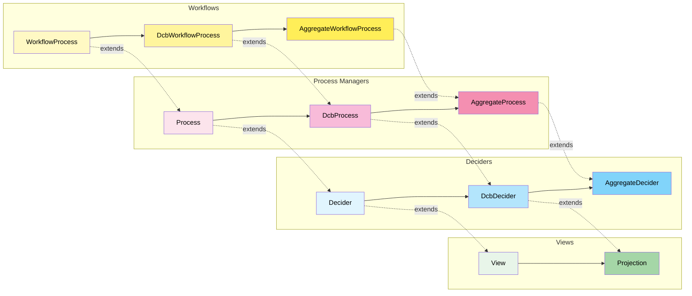

# fmodel-decider

**A spec-driven development framework** where the type system provides formal
constraints and the Given-When-Then DSL provides executable examples — together
forming a powerful foundation for building correct systems with AI assistance.

TypeScript library for modeling deciders (`command handlers`), process managers,
and views (`event handlers`) in domain-driven, event-sourced, or state-stored
architectures with progressive type refinement.


## Why fmodel-decider?

- **Type System as Specification**: Interfaces like `IDcbDecider` and
  `IAggregateDecider` are executable specifications that constrain
  implementations and guide AI code generation
- **Given-When-Then as Executable Examples**: Tests are specifications by
  example that serve as living documentation and formal requirements
- **Progressive Refinement**: Start with flexible types, add constraints
  incrementally as requirements clarify
- **AI-Friendly**: Formal types and concrete examples reduce hallucinations and
  guide AI tools to generate correct implementations
- **Production-Ready Infrastructure**: Complete event-sourced repository with
  Deno KV, optimistic locking, and flexible querying

## Table of Contents

- [Spec-Driven Development](#spec-driven-development)
- [Core Abstractions](#core-abstractions)
- [Progressive Type Refinement](#progressive-type-refinement)
- [Application Layer](#application-layer)
- [Idempotent Mode (Last-Event Optimization)](#idempotent-mode-last-event-optimization)
- [Deno KV Event-Sourced Repository](#deno-kv-event-sourced-repository)
- [Demo: Restaurant & Order Management](#demo-restaurant--order-management)
- [Testing](#testing)
- [Development](#development)
- [Further Reading](#further-reading)
- [Credits](#credits)

## Spec-Driven Development

fmodel-decider positions **specification as code** through two complementary
mechanisms:

### Type System as Formal Specification

The type hierarchy encodes domain modeling patterns as executable
specifications:

```ts
// Formal specification: Event-sourced computation
interface IEventComputation<C, Ei, Eo> {
  computeNewEvents(events: readonly Ei[], command: C): readonly Eo[];
}

// Formal specification: Dynamic consistency boundary
interface IDcbDecider<C, S, Ei, Eo>
  extends IDecider<C, S, S, Ei, Eo>, IEventComputation<C, Ei, Eo> {}
```

### Given-When-Then as Executable Examples

Tests are specifications by example that formally define behavior:

```ts
// "Given a restaurant exists, when placing an order, then order placed event is produced"
DeciderEventSourcedSpec.for(placeOrderDecider)
  .given([restaurantCreatedEvent])
  .when(placeOrderCommand)
  .then([restaurantOrderPlacedEvent]);

// "Given no restaurant exists, when placing an order, then throw error"
DeciderEventSourcedSpec.for(placeOrderDecider)
  .given([])
  .when(placeOrderCommand)
  .thenThrows((error) => error instanceof RestaurantNotFoundError);
```

Three specification formats are available:

| Format                    | Purpose                         | Compatible With                    |
| ------------------------- | ------------------------------- | ---------------------------------- |
| `DeciderEventSourcedSpec` | Event-sourced decider behavior  | `IDcbDecider`, `IAggregateDecider` |
| `DeciderStateStoredSpec`  | State-stored aggregate behavior | `IAggregateDecider` only           |
| `ViewSpecification`       | View/projection behavior        | `IProjection`                      |

### The Workflow: From Vibing to Viable

1. **Define types** (formal specification) → constrain the solution space
2. **Write Given-When-Then tests** (executable examples) → specify behavior
3. **Implement with AI assistance** (guided by specs) → generate correct code
4. **Verify and deploy** (type system + tests) → confidence in correctness

## Core Abstractions

| Abstraction           | Role                                                                 |
| --------------------- | -------------------------------------------------------------------- |
| **Decider**           | Pure functional command handler — decides events, evolves state      |
| **View / Projection** | Event-sourced read model — builds state from event streams           |
| **Process Manager**   | Orchestration — coordinates long-running workflows (smart ToDo list) |
| **Workflow Process**  | Specialized process manager with task-based state management         |

## Progressive Type Refinement

The library evolves from **general, flexible types** to **specific, constrained
types**. Each refinement step increases semantic meaning, eliminates impossible
states, and enables new capabilities.



### Computation Patterns

| Interface          | Purpose                                    | Method             |
| ------------------ | ------------------------------------------ | ------------------ |
| `EventComputation` | Event-sourced (replay events → new events) | `computeNewEvents` |
| `StateComputation` | State-stored (current state → new state)   | `computeNewState`  |

### Deciders

| Type                         | Constraint                   | Computation Mode             |
| ---------------------------- | ---------------------------- | ---------------------------- |
| `Decider<C, Si, So, Ei, Eo>` | All independent              | Generic                      |
| `DcbDecider<C, S, Ei, Eo>`   | `Si = So = S`                | Event-sourced                |
| `AggregateDecider<C, S, E>`  | `Si = So = S`, `Ei = Eo = E` | Event-sourced + State-stored |

### Views

| Type               | Constraint      | Computation Mode |
| ------------------ | --------------- | ---------------- |
| `View<Si, So, E>`  | All independent | Generic          |
| `Projection<S, E>` | `Si = So = S`   | State-stored     |

### Process Managers

| Type                             | Constraint                   | Computation Mode             |
| -------------------------------- | ---------------------------- | ---------------------------- |
| `Process<AR, Si, So, Ei, Eo, A>` | All independent              | Generic                      |
| `DcbProcess<AR, S, Ei, Eo, A>`   | `Si = So = S`                | Event-sourced                |
| `AggregateProcess<AR, S, E, A>`  | `Si = So = S`, `Ei = Eo = E` | Event-sourced + State-stored |

## Application Layer

The application layer bridges pure domain logic with infrastructure. Its key
principle is **metadata isolation** — domain logic stays pure and metadata-free,
with correlation IDs, timestamps, and versions added at the boundary.

```ts
// Domain layer — pure, no metadata
const orderDecider: IDcbDecider<
  OrderCommand,
  OrderState,
  OrderEvent,
  OrderEvent
>;

// Application layer — metadata introduced here
const handler = new EventSourcedCommandHandler(orderDecider, repository);
const events = await handler.handle(command); // Returns events + metadata
```

### Repository Interfaces

```ts
// Event-sourced: command + metadata → events + metadata
interface IEventRepository<C, Ei, Eo, CM, EM> {
  execute(
    command: C & CM,
    decider: IEventComputation<C, Ei, Eo>,
  ): Promise<readonly (Eo & EM)[]>;
}

// State-stored: command + metadata → state + metadata
interface IStateRepository<C, S, CM, SM> {
  execute(command: C & CM, decider: IStateComputation<C, S>): Promise<S & SM>;
}

// View state: event + metadata → state + metadata
interface IViewStateRepository<E, S, EM, SM> {
  execute(event: E & EM, view: IProjection<S, E>): Promise<S & SM>;
}
```

### Command & Event Handlers

| Handler                      | Bridges                      | Compatible With                    |
| ---------------------------- | ---------------------------- | ---------------------------------- |
| `EventSourcedCommandHandler` | Decider ↔ Event Repository   | `IDcbDecider`, `IAggregateDecider` |
| `StateStoredCommandHandler`  | Decider ↔ State Repository   | `IAggregateDecider` only           |
| `EventHandler`               | View ↔ View State Repository | `IProjection`                      |

## Deno KV Event-Sourced Repository

Production-ready event-sourced repository using Deno KV with optimistic locking,
flexible querying, and type-safe tag-based indexing.

### Architecture

```
Primary Storage:           ["events", eventId] → full event data
Secondary Tag Index:       ["events_by_type", eventType, ...tags, eventId] → eventId (pointer)
Last Event Pointer Index:  ["last_event", eventType, ...tags] → eventId (mutable pointer)
```

- Event data stored once; secondary indexes store only ULID pointers
- Automatically generates all tag subset combinations (2^n - 1 indexes per
  event)
- Last event pointers enable optimistic locking via versionstamp checks

### Tuple-Based Query Pattern

Query format: `[...tags, eventType]` — zero or more tags followed by event type.

```ts
// Load events for a specific use case
((cmd) => [
  ["restaurantId:" + cmd.restaurantId, "RestaurantCreatedEvent"],
  ["restaurantId:" + cmd.restaurantId, "RestaurantMenuChangedEvent"],
  ["orderId:" + cmd.orderId, "RestaurantOrderPlacedEvent"],
]);
```

### Type-Safe Tag Configuration

Events declare indexable fields via `tagFields`. Only string fields are allowed
as tags, enforced at compile time:

```ts
export type RestaurantCreatedEvent = TypeSafeEventShape<
  {
    readonly kind: "RestaurantCreatedEvent";
    readonly restaurantId: string;
    readonly name: string;
    readonly menu: Menu;
  },
  ["restaurantId"] // ← Compile-time validated tag fields
>;
```

### Tag Subset Generation & Write Amplification

The repository generates all non-empty tag subsets using binary enumeration,
trading write amplification for O(1) query performance:

| Tag Fields | Tag Subsets | Total Writes per Event | Formula                    |
| ---------- | ----------- | ---------------------- | -------------------------- |
| 0          | 0           | 1                      | 1 (event only)             |
| 1          | 1           | 3                      | 1 + 2(2^1-1)               |
| 2          | 3           | 7                      | 1 + 2(2^2-1)               |
| 3          | 7           | 15                     | 1 + 2(2^3-1)               |
| 5          | 31          | 63                     | 1 + 2(2^5-1) (default max) |

The max tag fields is configurable via the `maxTagFields` constructor parameter.

### Optimistic Locking

Uses `last_event` pointer versionstamps for concurrent append detection:

1. **Load** events + `last_event` pointer versionstamps per query tuple
2. **Compute** new events via decider
3. **Persist** atomically — checks versionstamps haven't changed, writes events
   - updates pointers
4. **Retry** on conflict (configurable, default: 10 attempts)

The `last_event` pointer is a Deno KV-specific solution to concurrent append
detection. Individual event index entries are immutable (each has a unique ULID
key), so without a mutable pointer, concurrent appends would go undetected.
Databases with richer transaction models (e.g., FoundationDB's read conflict
ranges) can detect conflicts on the index range itself, eliminating the need for
a separate pointer. That said, even in those environments the pointer can still
be valuable: it enables the idempotent/last-event optimization (O(1) reads
instead of full range scans) and provides a cheap "latest version" check without
touching the index.

### Concrete Repository Example

```ts
export const placeOrderRepository = (kv: Deno.Kv) =>
  new DenoKvEventSourcedRepository<
    PlaceOrderCommand,
    | RestaurantCreatedEvent
    | RestaurantMenuChangedEvent
    | RestaurantOrderPlacedEvent,
    RestaurantOrderPlacedEvent
  >(
    kv,
    (cmd) => [
      ["restaurantId:" + cmd.restaurantId, "RestaurantCreatedEvent"],
      ["restaurantId:" + cmd.restaurantId, "RestaurantMenuChangedEvent"],
      ["orderId:" + cmd.orderId, "RestaurantOrderPlacedEvent"],
    ],
  );
```

Integrates with command handlers via `IEventRepository`:

```ts
const handler = new EventSourcedCommandHandler(placeOrderDecider, repository);
const events = await handler.handle(placeOrderCommand);
// Returns events with metadata: eventId, timestamp, versionstamp
```

## Idempotent Mode (Last-Event Optimization)

Idempotent mode addresses two concerns: read performance and downstream delivery
guarantees.

### Read Optimization

Controlled by the `idempotent` constructor parameter (default: `true`):

| Mode                  | Reads per Tuple   | Events Fetched     | Best For                  |
| --------------------- | ----------------- | ------------------ | ------------------------- |
| Idempotent (`true`)   | O(1) pointer read | At most 1 (latest) | Snapshot-style events     |
| Full-replay (`false`) | O(n) range scan   | All matching       | Accumulation-style events |

### Downstream Idempotency

In distributed systems, exactly-once delivery is a myth — at-least-once is the
reality. Downstream event handlers (projections, process managers, integrations)
will inevitably receive duplicate events. Snapshot-style events make this a
non-issue: processing the same event twice produces the same state, because each
event carries the complete truth about its dimension. No deduplication logic, no
sequence tracking — idempotency comes for free from the event shape itself.

### Snapshot-Style vs. Accumulation-Style Events

A **snapshot-style event** fully describes its dimension of state at a point in
time. Think of it like destructuring a snapshot into its atomic facts:

```ts
// A snapshot is a composite of individual facts at a moment in time
const { x, y, z, t } = point;
// x, y, z are the facts (coordinates), t is when they occurred

// In domain terms, the "state" is destructured into independent events:
const { RestaurantRegistered, RestaurantMenuPublished, NOW } =
  OrderItemsAreOnTheMenu;
```

Each event captures the complete truth about its dimension — you only need the
latest one, not the full history. This is what makes the O(1) pointer read
correct: one event per (eventType, tags) combination is sufficient to
reconstruct state.

An **accumulation-style event** represents a delta — you need to replay all of
them to reconstruct state. Consider a `MoneyDeposited { amount: 100 }` event:
you can't know the balance from the latest deposit alone, you must sum every
deposit and withdrawal from the beginning. However, if you enrich it to
`MoneyDeposited { amount: 100, balance: 1500 }`, it becomes a snapshot-style
event — the latest one tells you the current balance. Note that you're not
polluting the event with all account details (name, address, etc.), just
carrying the dimension of state it affects: the balance. This small addition
enables both the O(1) read optimization and natural idempotency for downstream
handlers.

## Demo: Restaurant & Order Management

Two complete implementations showcase different architectural approaches to the
same domain.

### Scenario 1: Aggregate Pattern (`demo/aggregate/`)

Traditional DDD aggregates with strong consistency per entity. Uses
`AggregateDecider<C, S, E>` — supports both event-sourced and state-stored
computation. A workflow process coordinates between Restaurant and Order
aggregates.


### Scenario 2: Dynamic Consistency Boundary (`demo/dcb/`)

Flexible, use-case-driven boundaries using `DcbDecider<C, S, Ei, Eo>`. Each use
case defines its own consistency boundary — a single decider can span multiple
concepts. Event-sourced only. Deciders compose via `combineViaTuples()`.


Supports two repository strategies:

- **Sliced (Recommended):** Each use case has its own repository — aligns with
  vertical slice architecture, clearer boundaries
- **Combined:** Single repository handles all commands — simpler for small
  domains or prototyping

### Comparison

| Aspect          | Aggregate Pattern               | DCB Pattern                 |
| --------------- | ------------------------------- | --------------------------- |
| **Consistency** | Strong within aggregate         | Flexible per use case       |
| **Boundaries**  | Entity-centric                  | Use-case-centric            |
| **Computation** | Event-sourced + State-stored    | Event-sourced only          |
| **Composition** | Workflow coordinates aggregates | Deciders combine via tuples |
| **Complexity**  | Higher (more components)        | Lower (focused deciders)    |
| **Best for**    | Traditional DDD                 | Event-driven systems        |

### Running the Demos

```bash
deno test demo/aggregate/
deno test demo/dcb/
```

## Testing

```bash
deno test
```

## Development

```bash
deno task dev
```

## Publish to JSR (dry run)

```bash
deno publish --dry-run
```

## Further Reading

- [https://fmodel.fraktalio.com/](https://fmodel.fraktalio.com/)

## Credits

Special credits to `Jérémie Chassaing` for sharing his
[research](https://www.youtube.com/watch?v=kgYGMVDHQHs) and `Adam Dymitruk` for
hosting the meetup.

---

Created with :heart: by [Fraktalio](https://fraktalio.com/)

Excited to launch your next IT project with us? Let's get started! Reach out to
our team at `info@fraktalio.com` to begin the journey to success.
