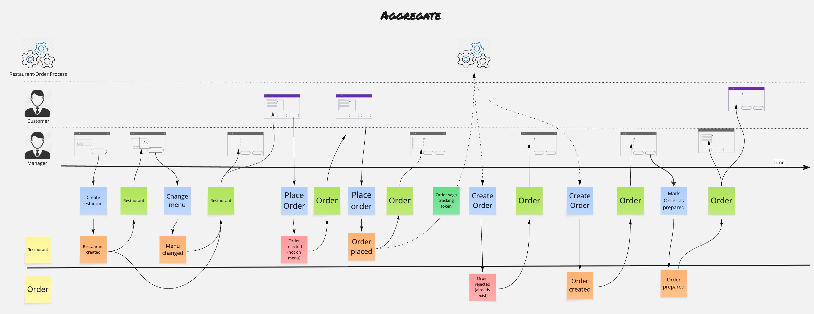
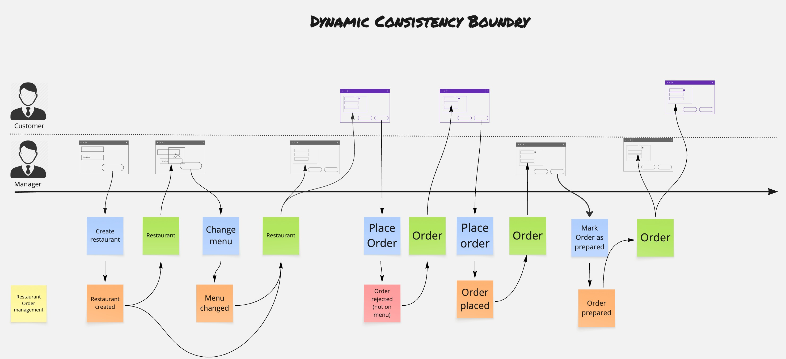

# fmodel-decider

TypeScript library for modeling deciders (`command handlers`), process managers,
and views (`event handlers`) in domain-driven, event-sourced, or state-stored
architectures with progressive type refinement.


## Progressive Type Refinement Philosophy

This library demonstrates how to evolve from **general, flexible types** to
**specific, constrained types** that better represent real-world information
systems. Starting with the most generic interfaces that support all possible
type combinations, we progressively add constraints that:

- **Increase semantic meaning** - Each refinement step adds domain-specific
  behavior
- **Reduce complexity** - Constraints eliminate impossible states and invalid
  operations
- **Improve usability** - More specific types provide better APIs and clearer
  intent
- **Enable optimizations** - Constraints allow for more efficient
  implementations

This approach mirrors how we model information systems: beginning with broad
concepts and iteratively refining them into precise, domain-specific
abstractions that capture business rules and invariants.

## Educational Purpose

This library serves as both a **practical toolkit** and an **educational
resource** for understanding:

- **Functional domain modeling** patterns in TypeScript
- **Progressive type refinement** as a design methodology
- **Event-sourced** and **state-stored** computation patterns
- **Process orchestration** and **workflow** management
- **Read-side projections** and view materialization

```ts
// Computation Pattern Interfaces
export interface EventComputation<C, Ei, Eo> {
  computeNewEvents(events: readonly Ei[], command: C): readonly Eo[];
}

export interface StateComputation<C, S> {
  computeNewState(state: S, command: C): S;
}

// View Hierarchy
export interface IView<Si, So, E> {
  readonly evolve: (state: Si, event: E) => So;
  readonly initialState: So;
}

export interface IProjection<S, E> extends IView<S, S, E> {
}

// Decider Hierarchy
export interface IDecider<C, Si, So, Ei, Eo> extends IView<Si, So, Ei> {
  readonly decide: (command: C, state: Si) => readonly Eo[];
}

export interface IDcbDecider<C, S, Ei, Eo>
  extends
    IDecider<C, S, S, Ei, Eo>,
    IProjection<S, Ei>,
    EventComputation<C, Ei, Eo> {
}

export interface IAggregateDecider<C, S, E>
  extends IDcbDecider<C, S, E, E>, StateComputation<C, S> {
}

// Process Manager Hierarchy
export interface IProcess<AR, Si, So, Ei, Eo, A>
  extends IDecider<AR, Si, So, Ei, Eo> {
  readonly react: (state: Si, event: Ei) => readonly A[];
  readonly pending: (state: Si) => readonly A[];
}

export interface IDcbProcess<AR, S, Ei, Eo, A>
  extends IProcess<AR, S, S, Ei, Eo, A>, IDcbDecider<AR, S, Ei, Eo> {
}

export interface IAggregateProcess<AR, S, E, A>
  extends IDcbProcess<AR, S, E, E, A>, IAggregateDecider<AR, S, E> {
}

// Workflow Hierarchy
export interface IWorkflowProcess<AR, A, TaskName extends string = string>
  extends
    IProcess<
      AR,
      WorkflowState<TaskName>,
      WorkflowState<TaskName>,
      WorkflowEvent<TaskName>,
      WorkflowEvent<TaskName>,
      A
    > {
  readonly createTaskStarted: (
    taskName: TaskName,
    metadata?: Record<string, unknown>,
  ) => TaskStarted<TaskName>;

  readonly createTaskCompleted: (
    taskName: TaskName,
    result?: unknown,
    metadata?: Record<string, unknown>,
  ) => TaskCompleted<TaskName>;

  readonly getTaskStatus: (
    state: WorkflowState<TaskName>,
    taskName: TaskName,
  ) => TaskStatus | undefined;

  readonly isTaskStarted: (
    state: WorkflowState<TaskName>,
    taskName: TaskName,
  ) => boolean;

  readonly isTaskCompleted: (
    state: WorkflowState<TaskName>,
    taskName: TaskName,
  ) => boolean;
}

export interface IDcbWorkflowProcess<AR, A, TaskName extends string = string>
  extends
    IWorkflowProcess<AR, A, TaskName>,
    IDcbProcess<
      AR,
      WorkflowState<TaskName>,
      WorkflowEvent<TaskName>,
      WorkflowEvent<TaskName>,
      A
    > {
}

export interface IAggregateWorkflowProcess<
  AR,
  A,
  TaskName extends string = string,
> extends
  IWorkflowProcess<AR, A, TaskName>,
  IAggregateProcess<AR, WorkflowState<TaskName>, WorkflowEvent<TaskName>, A> {
}
```

## What is a View?

A View is a pure functional component that builds up state by processing events:

- **Evolves** state when given an event (read-side projection)
- **Defines** an initial state
- **Supports** independent input and output state types for complex
  transformations

Views are the read-side complement to Deciders, enabling event-sourced
projections and read models.

## What is a Decider?

A Decider is a pure functional component that:

- **Decides** which events to emit given a command and current state
- **Evolves** state when given an event
- **Defines** an initial state

This pattern separates decision logic from state mutation, improving testability
and reasoning about behavior.

## What is a Process Manager?

A Process Manager extends a Decider with orchestration capabilities, acting as a
smart ToDo list:

- **Decides** which events to emit given an action result and current state
- **Evolves** state when given an event
- **Reacts** to events by determining which actions become ready to execute
- **Maintains** a complete ToDo list of all possible pending actions

Process Managers coordinate long-running business processes and manage complex
workflows.

## Application Layer

The application layer is the **bridge** between pure domain logic (deciders,
views, processes) and infrastructure concerns (databases, event stores, message
queues). Its primary role is to coordinate execution while introducing
**metadata** (correlation IDs, timestamps, versions) at the boundary without
polluting the core domain model.

### Key Design Principle: Metadata Isolation

**Core domain (Deciders, Views, Processes)** remain pure and metadata-free:

```ts
// Domain layer - no metadata, pure business logic
const orderDecider: IDcbDecider<
  OrderCommand,
  OrderState,
  OrderEvent,
  OrderEvent
>;
```

**Application layer** introduces metadata at the boundary:

```ts
// Application layer - metadata added here
const handler: EventSourcedCommandHandler<
  OrderCommand,
  OrderEvent,
  OrderEvent,
  CommandMetadata, // ← Metadata introduced
  EventMetadata // ← Metadata introduced
>;
```

This separation ensures domain logic remains testable, portable, and focused on
business rules.

### Repository Interfaces

The application layer defines repository contracts based on computation
patterns:

```ts
// Event-sourced repository
export interface IEventRepository<C, Ei, Eo, CM, EM> {
  readonly execute: (
    command: C & CM, // Command + metadata
    decider: IEventComputation<C, Ei, Eo>, // Pure computation
  ) => Promise<readonly (Eo & EM)[]>; // Events + metadata
}

// State-stored repository
export interface IStateRepository<C, S, CM, SM> {
  readonly execute: (
    command: C & CM, // Command + metadata
    decider: IStateComputation<C, S>, // Pure computation
  ) => Promise<S & SM>; // State + metadata
}

// View state repository
export interface IViewStateRepository<E, S, EM, SM> {
  readonly execute: (
    event: E & EM, // Event + metadata
    view: IProjection<S, E>, // Pure projection
  ) => Promise<S & SM>; // State + metadata
}
```

**Key benefits:**

- Repositories depend only on computation interfaces (`IEventComputation`,
  `IStateComputation`) or projections (`IProjection`)
- Metadata flows through the application layer without touching domain logic
- Clean separation between domain concerns and infrastructure concerns

### Command Handlers: The Bridge Pattern

Command handlers are the **bridge** that connects pure domain logic with
infrastructure. They delegate to repositories while keeping domain logic
isolated.

#### Event-Sourced Command Handler

```ts
export class EventSourcedCommandHandler<C, Ei, Eo, CM, EM> {
  constructor(
    private readonly decider: IEventComputation<C, Ei, Eo>,
    private readonly eventRepository: IEventRepository<C, Ei, Eo, CM, EM>,
  ) {}

  handle(command: C & CM): Promise<readonly (Eo & EM)[]> {
    // Delegates to repository, which:
    // 1. Loads event stream
    // 2. Passes events + command to decider
    // 3. Persists new events with metadata
    return this.eventRepository.execute(command, this.decider);
  }
}
```

**Complete example showing the delegation flow:**

```ts
import { EventSourcedCommandHandler } from "./application.ts";
import { createRestaurantRepository } from "./demo/dcb/createRestaurantRepository.ts";
import { crateRestaurantDecider } from "./demo/dcb/createRestaurantDecider.ts";

// 1. Create repository (infrastructure)
const kv = await Deno.openKv();
const repository = createRestaurantRepository(kv);

// 2. Create handler (bridge between domain and infrastructure)
const handler = new EventSourcedCommandHandler(
  crateRestaurantDecider, // Pure domain logic
  repository, // Infrastructure
);

// 3. Execute command
const command = {
  kind: "CreateRestaurantCommand",
  restaurantId: "restaurant-123",
  name: "Bistro",
  menu: {
    menuId: "menu-1",
    cuisine: "ITALIAN",
    menuItems: [{ menuItemId: "item-1", name: "Pizza", price: "12.99" }],
  },
};

// Handler delegates to repository, which:
// 1. Loads events for restaurant-123
// 2. Calls decider.computeNewEvents(events, command)
// 3. Persists new events with metadata (eventId, timestamp, versionstamp)
const events = await handler.handle(command);

console.log(events);
// [
//   {
//     kind: "RestaurantCreatedEvent",
//     restaurantId: "restaurant-123",
//     name: "Bistro",
//     menu: { ... },
//     eventId: "01JBQR8X9Y...",      // ← Metadata added by repository
//     timestamp: 1735123456789,       // ← Metadata added by repository
//     versionstamp: "00000000000..." // ← Metadata added by repository
//   }
// ]
```

**Decider compatibility:**

- Works with any `IEventComputation` implementation:
  - `IDcbDecider<C, S, Ei, Eo>` for dynamic consistency boundaries
  - `IAggregateDecider<C, S, E>` for traditional aggregates

#### State-Stored Command Handler

```ts
export class StateStoredCommandHandler<C, S, CM, SM> {
  constructor(
    private readonly decider: IStateComputation<C, S>,
    private readonly stateRepository: IStateRepository<C, S, CM, SM>,
  ) {}

  handle(command: C & CM): Promise<S & SM> {
    // Delegates to repository, which:
    // 1. Loads current state
    // 2. Passes state + command to decider
    // 3. Persists new state with metadata
    return this.stateRepository.execute(command, this.decider);
  }
}
```

**Decider compatibility:**

- Works only with `IStateComputation` implementations:
  - `IAggregateDecider<C, S, E>` (the only built-in implementation)

### Event Handlers: Read-Side Bridge

Event handlers coordinate between views/projections and view state repositories:

```ts
export class EventHandler<E, S, EM, SM> {
  constructor(
    private readonly view: IProjection<S, E>,
    private readonly viewStateRepository: IViewStateRepository<E, S, EM, SM>,
  ) {}

  handle(event: E & EM): Promise<S & SM> {
    // Delegates to repository, which:
    // 1. Loads current view state
    // 2. Passes state + event to view
    // 3. Persists updated state with metadata
    return this.viewStateRepository.execute(event, this.view);
  }
}
```

**View compatibility:**

- Works with `IProjection<S, E>` implementations
- Suitable for read models, query models, and materialized views
- Processes events to build and maintain view state

### Why This Design Matters

The application layer provides:

1. **Separation of concerns:** Domain logic stays pure, infrastructure stays
   isolated
2. **Testability:** Test domain logic without infrastructure dependencies
3. **Flexibility:** Swap infrastructure implementations without changing domain
   code
4. **Metadata management:** Correlation IDs, timestamps, versions added at the
   boundary
5. **Type safety:** Compile-time guarantees for command/event/state types

This design keeps domain logic pure while providing flexible infrastructure
integration.

## Deno KV Event-Sourced Repository

The library includes a production-ready event-sourced repository implementation
using Deno KV (`DenoKvEventSourcedRepository`). This implementation demonstrates
how to build a complete event-sourced infrastructure with optimistic locking,
flexible querying, and type-safe tag-based event indexing.

### Architecture: Two-Index Pattern with Pointers

The repository uses a dual-index architecture optimized for both storage
efficiency and query flexibility:

```
Primary Storage:  ["events", eventId] → full event data
Tag Index:        ["events_by_type", eventType, ...tags, eventId] → eventId (pointer)
```

**Example index structures:**

```
// No tags - query all events of a type
["events_by_type", "RestaurantCreatedEvent", eventId] → eventId

// Single tag - query by one dimension
["events_by_type", "RestaurantCreatedEvent", "restaurantId:r1", eventId] → eventId

// Multiple tags - query by multiple dimensions
["events_by_type", "OrderPlacedEvent", "restaurantId:r1", "customerId:c1", eventId] → eventId
```

**Key benefits:**

- **Storage efficiency:** Event data stored once, indexes store only pointers
  (ULIDs)
- **Flexible queries:** Query by event type and any combination of tags
- **Tag subsets:** Automatically generates all tag subset combinations for
  maximum query flexibility (2^n - 1 indexes per event)
- **Optimistic locking:** Versionstamps on index entries enable conflict
  detection
- **Chronological ordering:** Monotonic ULIDs ensure correct event ordering

### Tuple-Based Query Pattern

The repository's most powerful feature is its tuple-based query pattern, which
allows loading events using zero or more tags followed by an event type:

```ts
// No tags - load all events of a type
(cmd) => [
  ["RestaurantCreatedEvent"]
]

// Single tag - load events filtered by one dimension
(cmd) => [
  ["restaurantId:" + cmd.restaurantId, "RestaurantCreatedEvent"]
]

// Multiple tags - load events filtered by multiple dimensions
(cmd) => [
  ["restaurantId:" + cmd.restaurantId, "customerId:" + cmd.customerId, "OrderPlacedEvent"]
]

// Complex case: Multiple query tuples for different event types
(cmd) => [
  ["restaurantId:" + cmd.restaurantId, "RestaurantCreatedEvent"],
  ["restaurantId:" + cmd.restaurantId, "RestaurantMenuChangedEvent"],
  ["orderId:" + cmd.orderId, "RestaurantOrderPlacedEvent"],
]
```

**Query tuple format:** `[...tags, eventType]`

- **Tags** (optional): Zero or more tags in "fieldName:fieldValue" format
- **Event type** (required): The kind of event to query (last element)

This flexibility is essential for DCB patterns where consistency boundaries span
multiple concepts and require loading events from different aggregates.

### Type-Safe Tag-Based Event Indexing

The repository leverages TypeScript's type system and event metadata to provide
flexible, type-safe indexing:

#### Tag Fields Configuration

Events declare which fields should be indexed as tags using the `tagFields`
property:

```ts
export type RestaurantCreatedEvent = TypeSafeEventShape<
  {
    readonly kind: "RestaurantCreatedEvent";
    readonly restaurantId: string;
    readonly name: string;
    readonly menu: Menu;
  },
  ["restaurantId"] // ← Only string fields can be tags
>;

export type OrderPlacedEvent = TypeSafeEventShape<
  {
    readonly kind: "OrderPlacedEvent";
    readonly orderId: string;
    readonly restaurantId: string;
    readonly customerId: string;
    readonly items: MenuItem[];
  },
  ["orderId", "restaurantId", "customerId"] // ← Multiple tags for flexible querying
>;
```

**Type safety guarantees:**

- ✅ Only string-typed fields can be configured as tags
- ✅ Compile-time validation prevents typos
- ✅ Autocomplete for available tag fields
- ❌ Cannot specify non-existent fields
- ❌ Cannot specify non-string fields (numbers, objects, arrays)

#### Tag Subset Generation

The repository automatically generates all possible tag subset combinations for
maximum query flexibility using binary enumeration (2^n - 1 indexes per event):

**Algorithm visualization:**

```
Given tags: [A, B, C]
Binary enumeration from 1 to 2^3 - 1 = 7:

Binary  | Bits | Selected Tags | Index Entry
--------|------|---------------|------------------
001     | ..1  | [A]           | [..., A, eventId]
010     | .1.  | [B]           | [..., B, eventId]
011     | .11  | [A, B]        | [..., A, B, eventId]
100     | 1..  | [C]           | [..., C, eventId]
101     | 1.1  | [A, C]        | [..., A, C, eventId]
110     | 11.  | [B, C]        | [..., B, C, eventId]
111     | 111  | [A, B, C]     | [..., A, B, C, eventId]
```

**Concrete example:**

```ts
// Event with tags: ["restaurantId:r1", "customerId:c1"]
// Generates 3 index entries (2^2 - 1):

["events_by_type", "OrderPlacedEvent", "customerId:c1", eventId] → eventId
["events_by_type", "OrderPlacedEvent", "restaurantId:r1", eventId] → eventId
["events_by_type", "OrderPlacedEvent", "customerId:c1", "restaurantId:r1", eventId] → eventId
```

**Visual representation of subset generation:**

```
Tags: [restaurantId, customerId]

                    ∅ (empty - not indexed)
                   / \
                  /   \
                 /     \
          [restaurantId] [customerId]
                 \     /
                  \   /
                   \ /
        [restaurantId, customerId]

Result: 3 non-empty subsets = 2^2 - 1
```

**Write Amplification Trade-off:**

The repository trades write amplification for O(1) query performance. Here's how
the number of indexes grows with tag count:

| Tag Fields | Index Entries | Formula  | Example Event                    |
| ---------- | ------------- | -------- | -------------------------------- |
| 0          | 0             | 2^0 - 1  | No tags                          |
| 1          | 1             | 2^1 - 1  | `["orderId"]`                    |
| 2          | 3             | 2^2 - 1  | `["orderId", "restaurantId"]`    |
| 3          | 7             | 2^3 - 1  | `["orderId", "restaurantId", "customerId"]` |
| 4          | 15            | 2^4 - 1  | Add `"status"`                   |
| 5          | 31            | 2^5 - 1  | Add `"priority"` (maximum)       |

**Concrete example with 3 tags:**

```ts
// Event configuration
export type OrderPlacedEvent = TypeSafeEventShape<
  {
    readonly kind: "OrderPlacedEvent";
    readonly orderId: string;
    readonly restaurantId: string;
    readonly customerId: string;
  },
  ["orderId", "restaurantId", "customerId"] // 3 tags
>;

// When persisting this event:
const event = {
  kind: "OrderPlacedEvent",
  orderId: "o1",
  restaurantId: "r1",
  customerId: "c1",
  tagFields: ["orderId", "restaurantId", "customerId"],
};

// Repository generates 7 index entries (2^3 - 1):
["events_by_type", "OrderPlacedEvent", "customerId:c1", eventId]
["events_by_type", "OrderPlacedEvent", "orderId:o1", eventId]
["events_by_type", "OrderPlacedEvent", "restaurantId:r1", eventId]
["events_by_type", "OrderPlacedEvent", "customerId:c1", "orderId:o1", eventId]
["events_by_type", "OrderPlacedEvent", "customerId:c1", "restaurantId:r1", eventId]
["events_by_type", "OrderPlacedEvent", "orderId:o1", "restaurantId:r1", eventId]
["events_by_type", "OrderPlacedEvent", "customerId:c1", "orderId:o1", "restaurantId:r1", eventId]

// This enables flexible queries:
// - Query by customer: ["customerId:c1", "OrderPlacedEvent"]
// - Query by order: ["orderId:o1", "OrderPlacedEvent"]
// - Query by restaurant: ["restaurantId:r1", "OrderPlacedEvent"]
// - Query by customer + restaurant: ["customerId:c1", "restaurantId:r1", "OrderPlacedEvent"]
// - Any other combination!
```

**Why this trade-off makes sense:**

- ✅ **Reads are frequent:** Queries happen far more often than writes in most
  systems
- ✅ **O(1) query performance:** No need to scan or filter, direct index lookup
- ✅ **Flexible querying:** Any tag combination works without additional indexes
- ⚠️ **Write cost:** Each event write creates multiple index entries
- ⚠️ **Storage cost:** More index entries consume more storage

**Limit:** Maximum 5 tag fields per event (31 index entries) to bound write
amplification

#### Query Tuple Type Safety

The repository constructor enforces type-safe query tuples:

```ts
export class DenoKvEventSourcedRepository<
  C extends CommandShape,
  Ei extends EventShape,
  Eo extends EventShape,
> {
  constructor(
    private readonly kv: Deno.Kv,
    // Query tuples constrained to valid event types!
    private readonly getQueryTuples: (
      command: C,
    ) => QueryTuple<Ei>[], // ← [...string[], Ei["kind"]]
    private readonly maxRetries: number = 10,
  ) {}
}
```

**Benefits:**

- Autocomplete for event type strings
- Compile-time validation of event types
- Impossible to query for non-existent event types
- Tags are validated at runtime (extracted from events)

### Optimistic Locking with Automatic Retry

The repository implements optimistic locking using Deno KV's versionstamps:

```ts
async execute(
  command: C,
  decider: IEventComputation<C, Ei, Eo>,
): Promise<readonly (Eo & EventMetadata)[]> {
  let attempts = 0;
  
  while (attempts < this.maxRetries) {
    attempts++;
    
    // 1. Load events with versionstamps
    const { events, indexKeys } = await this.loadEvents(...);
    
    // 2. Compute new events using decider
    const newEvents = decider.computeNewEvents(events, command);
    
    // 3. Attempt atomic write with versionstamp checks
    const persistedEvents = await this.persistEvents(newEvents, indexKeys);
    
    if (persistedEvents) {
      return persistedEvents; // Success!
    }
    
    // Conflict detected, retry
  }
  
  throw new OptimisticLockingError(attempts, entityId);
}
```

**Key features:**

- Automatic retry on conflicts
- Configurable retry limit
- Atomic operations ensure consistency
- No lost updates

### Concrete Repository Example

Here's how to create a concrete repository factory function for a specific use
case:

```ts
/**
 * Creates a repository for PlaceOrder decider.
 *
 * **Query Pattern:**
 * Loads events using tuples:
 * - `[(restaurantId, "RestaurantCreatedEvent")]`
 * - `[(restaurantId, "RestaurantMenuChangedEvent")]`
 * - `[(orderId, "RestaurantOrderPlacedEvent")]`
 *
 * **Tag Configuration:**
 * - RestaurantCreatedEvent: tagFields = ["restaurantId"]
 * - RestaurantMenuChangedEvent: tagFields = ["restaurantId"]
 * - RestaurantOrderPlacedEvent: tagFields = ["orderId", "restaurantId"]
 */
export const placeOrderRepository = (kv: Deno.Kv) =>
  new DenoKvEventSourcedRepository<
    PlaceOrderCommand,
    | RestaurantCreatedEvent
    | RestaurantMenuChangedEvent
    | RestaurantOrderPlacedEvent,
    RestaurantOrderPlacedEvent
  >(
    kv,
    // Query pattern: Load restaurant state + check if order exists
    (cmd) => [
      ["restaurantId:" + cmd.restaurantId, "RestaurantCreatedEvent"],
      ["restaurantId:" + cmd.restaurantId, "RestaurantMenuChangedEvent"],
      ["orderId:" + cmd.orderId, "RestaurantOrderPlacedEvent"],
    ],
  );
```

**How it works:**

1. **Query tuples** specify which events to load using tags
2. **Repository** scans tag indexes to find matching events
3. **Events** are loaded from primary storage and sorted chronologically
4. **Decider** computes new events based on loaded history
5. **New events** are persisted with automatic tag index generation

### Integration with Command Handlers

The repository implements `IEventRepository` and integrates seamlessly with
command handlers:

```ts
import { EventSourcedCommandHandler } from "./application.ts";
import { placeOrderRepository } from "./demo/dcb/placeOrderRepository.ts";
import { placeOrderDecider } from "./demo/dcb/placeOrderDecider.ts";

// Create repository
const kv = await Deno.openKv();
const repository = placeOrderRepository(kv);

// Create command handler
const handler = new EventSourcedCommandHandler(
  placeOrderDecider,
  repository,
);

// Execute command
const events = await handler.handle({
  kind: "PlaceOrderCommand",
  restaurantId: "restaurant-123",
  orderId: "order-456",
  menuItems: [{ menuItemId: "item-1", name: "Pizza", price: "12.99" }],
});

// Events returned with metadata
console.log(events);
// [
//   {
//     kind: "RestaurantOrderPlacedEvent",
//     restaurantId: "restaurant-123",
//     orderId: "order-456",
//     menuItems: [...],
//     tagFields: ["orderId", "restaurantId"], // ← Tag configuration
//     eventId: "01JBQR8X9Y...",                // ← Metadata
//     timestamp: 1735123456789,                 // ← Metadata
//     versionstamp: "00000000000..."           // ← Metadata
//   }
// ]
```

### Why This Makes the Library Framework-Like

This implementation elevates the library from a modeling toolkit to a
near-framework by providing:

1. **Complete infrastructure:** Production-ready event store with Deno KV
2. **Optimistic locking:** Built-in concurrency control
3. **Flexible querying:** Tuple-based pattern supports complex use cases
4. **Type safety:** Compile-time validation of event types and queries
5. **Metadata handling:** Automatic event IDs, timestamps, and versionstamps
6. **Error handling:** Structured errors for domain and infrastructure concerns
7. **Testing support:** In-memory Deno KV for fast, isolated tests

**What you get out of the box:**

- ✅ Event store implementation
- ✅ Optimistic locking with retry
- ✅ Event indexing and querying
- ✅ Metadata management
- ✅ Type-safe repository pattern
- ✅ Integration with command handlers
- ✅ Comprehensive test coverage

**What you still control:**

- Domain logic (deciders)
- Event schema
- Command schema
- Consistency boundaries
- Business rules

This strikes the perfect balance: opinionated infrastructure with flexible
domain modeling.

### Demo Implementation

See `demo/dcb/` for a complete working example with:

- `denoKvRepository.ts` (root level) - Generic Deno KV event-sourced repository
- `createRestaurantRepository.ts` - Restaurant creation
- `placeOrderRepository.ts` - Order placement (spans multiple entities)
- `markOrderAsPreparedRepository.ts` - Order preparation
- Comprehensive integration tests

## Progressive Type Refinement

Each refinement step increases capability and constraint:

### Computation Patterns

The library defines two fundamental computation patterns:

| Interface          | Purpose                                   | Method             |
| ------------------ | ----------------------------------------- | ------------------ |
| `EventComputation` | Event-sourced computation (replay events) | `computeNewEvents` |
| `StateComputation` | State-stored computation (direct state)   | `computeNewState`  |

### Deciders

| Class                        | Type constraint              | Implements                                            | Computation mode            |
| ---------------------------- | ---------------------------- | ----------------------------------------------------- | --------------------------- |
| `Decider<C, Si, So, Ei, Eo>` | all independent              | -                                                     | generic                     |
| `DcbDecider<C, S, Ei, Eo>`   | `Si = So = S`                | `EventComputation<C, Ei, Eo>`                         | event-sourced               |
| `AggregateDecider<C, S, E>`  | `Si = So = S`, `Ei = Eo = E` | `EventComputation<C, E, E>`, `StateComputation<C, S>` | event-sourced, state-stored |

### Views

| Class              | Type constraint | Computation mode |
| ------------------ | --------------- | ---------------- |
| `View<Si, So, E>`  | all independent | generic          |
| `Projection<S, E>` | `Si = So = S`   | state-stored     |

### Process Managers

Process managers follow the same progressive refinement pattern as Deciders:

| Class                            | Type constraint              | Implements                                              | Computation mode            |
| -------------------------------- | ---------------------------- | ------------------------------------------------------- | --------------------------- |
| `Process<AR, Si, So, Ei, Eo, A>` | all independent              | -                                                       | generic                     |
| `DcbProcess<AR, S, Ei, Eo, A>`   | `Si = So = S`                | `EventComputation<AR, Ei, Eo>`                          | event-sourced               |
| `AggregateProcess<AR, S, E, A>`  | `Si = So = S`, `Ei = Eo = E` | `EventComputation<AR, E, E>`, `StateComputation<AR, S>` | event-sourced, state-stored |

## Key Differences

### Deciders

| Concept           | `DcbDecider`           | `AggregateDecider`              |
| ----------------- | ---------------------- | ------------------------------- |
| **Event-sourced** | ✅ Supported           | ✔️ Supported (limited: Ei = Eo) |
| **State-stored**  | ❌ Not possible        | ✅ Supported                    |
| **Use case**      | Cross-concept boundary | Single-concept / DDD Aggregate  |

### Views

| Concept                  | `Projection`                    |
| ------------------------ | ------------------------------- |
| **State transformation** | ✅ Constrained Si = So = S      |
| **Use case**             | Read models / Event projections |

### Process Managers

| Concept                   | `DcbProcess`     | `AggregateProcess`                   |
| ------------------------- | ---------------- | ------------------------------------ |
| **Event-sourced**         | ✅ Supported     | ✔️ Supported (limited: Ei = Eo)      |
| **State-stored**          | ❌ Not possible  | ✅ Supported                         |
| **Process orchestration** | ✅ Supported     | ✅ Supported                         |
| **Use case**              | Unknown, for now | Process manager/Automation/ToDo List |

## Demo: Restaurant & Order Management

The library includes two complete demo implementations showcasing different
architectural approaches to the same domain problem. Both demos model a
restaurant ordering system but differ in how they define consistency boundaries.

### Scenario 1: Aggregate Pattern (`demo/aggregate/`)

**Consistency Boundary:** Traditional DDD Aggregates with strong consistency
within each aggregate root.



This approach uses `AggregateDecider<C, S, E>` where each aggregate (Restaurant,
Order) maintains its own consistency boundary:

```ts
// Restaurant Aggregate - manages restaurant state
const restaurantDecider: AggregateDecider<
  RestaurantCommand,
  Restaurant | null,
  RestaurantEvent
>;

// Order Aggregate - manages order state
const orderDecider: AggregateDecider<
  OrderCommand,
  Order | null,
  OrderEvent
>;

// Workflow Process - coordinates between aggregates
const restaurantOrderWorkflow: AggregateWorkflowProcess<
  Event,
  Command,
  OrderTaskName
>;
```

**Key Characteristics:**

- **Strong boundaries:** Each aggregate is independently consistent
- **Event-sourced & state-stored:** Supports both computation modes
- **Cross-aggregate coordination:** Workflow process orchestrates between
  Restaurant and Order

**When to use:**

- Traditional DDD aggregate roots
- Clear entity lifecycle management
- Need for both event-sourced and state-stored operations

**Files:**

- `restaurantDecider.ts` - Restaurant aggregate logic
- `orderDecider.ts` - Order aggregate logic
- `restaurantOrderWorkflow.ts` - Cross-aggregate orchestration
- `restaurantView.ts` / `orderView.ts` - Read model projections

### Scenario 2: Dynamic Consistency Boundary (DCB) Pattern (`demo/dcb/`)

**Consistency Boundary:** Flexible, use-case-driven boundaries that can span
multiple concepts.



This approach uses `DcbDecider<C, S, Ei, Eo>` where each use case (command)
defines its own consistency boundary:

```ts
// Each use case is a separate decider with its own state
const createRestaurantDecider: DcbDecider<
  CreateRestaurantCommand,
  CreateRestaurantState,
  RestaurantEvent,
  RestaurantCreatedEvent
>;

const placeOrderDecider: DcbDecider<
  PlaceOrderCommand,
  PlaceOrderState,
  RestaurantEvent | OrderEvent,
  RestaurantOrderPlacedEvent
>;

// Combined into a single domain decider
const allDomainDecider = createRestaurantDecider
  .combineViaTuples(changeRestaurantMenuDecider)
  .combineViaTuples(placeOrderDecider)
  .combineViaTuples(markOrderAsPreparedDecider);
```

**Repository Approaches:**

The DCB pattern supports two valid approaches for organizing repositories:

**1. Sliced Approach (Separate Repositories):**

```ts
// Each use case has its own repository
const createRepo = new CreateRestaurantRepository(kv);
const placeOrderRepo = new PlaceOrderRepository(kv);

await createRepo.execute(createRestaurantCommand);
await placeOrderRepo.execute(placeOrderCommand);
```

- ✅ Only relevant decider processes each command (better performance)
- ✅ Simple, focused query patterns per use case
- ✅ Explicit use case boundaries
- ⚠️ More repository instances to manage

**2. Combined Approach (Single Repository):**

```ts
// Single repository handles all commands
const repository = new AllDeciderRepository(kv);

await repository.execute(createRestaurantCommand);
await repository.execute(placeOrderCommand);
```

- ✅ Simpler application code (one repository instance)
- ✅ Works due to graceful null handling in deciders
- ⚠️ All deciders process every command (more computation)
- ⚠️ Complex query pattern must handle all use cases

**Choose based on your needs:**

- **Sliced:** Better for larger domains, performance-critical applications,
  clearer boundaries
- **Combined:** Better for smaller domains, simpler architecture, acceptable
  overhead

See `demo/dcb/all_deciderRepository.ts` for a complete combined approach
example.

**Key Characteristics:**

- **Flexible boundaries:** Each use case defines what it needs
- **Event-sourced only:** Optimized for event-driven architectures
- **Cross-concept operations:** Single decider can span Restaurant and Order
- **Compositional:** Deciders combine via tuples to form complete domain model

**When to use:**

- Event-sourced systems with flexible consistency requirements
- Use cases that naturally span multiple concepts (Order, Restaurant, ...)

**Files:**

- `createRestaurant.ts` - Restaurant creation use case
- `changeRestaurantMenu.ts` - Menu update use case
- `placeOrder.ts` - Order placement (spans Restaurant + Order)
- `markOrderAsPrepared.ts` - Order preparation use case

### Comparison

| Aspect          | Aggregate Pattern                  | DCB Pattern                                     |
| --------------- | ---------------------------------- | ----------------------------------------------- |
| **Consistency** | Strong within aggregate            | Flexible per use case                           |
| **Boundaries**  | Entity-centric (Restaurant, Order) | Use-case-centric (CreateRestaurant, PlaceOrder) |
| **State model** | Aggregate state                    | Use-case-specific state                         |
| **Composition** | Workflow coordinates aggregates    | Deciders combine via tuples                     |
| **Computation** | Event-sourced + State-stored       | Event-sourced only                              |
| **Complexity**  | Higher (more components)           | Lower (focused deciders)                        |
| **Best for**    | Traditional DDD                    | Event-driven, Event0sourced S systems           |

### Running the Demos

```bash
# Run all aggregate tests
deno test demo/aggregate/

# Run all DCB tests  
deno test demo/dcb/

# Run specific test file
deno test demo/aggregate/restaurantDecider_test.ts
```

Both demos include:

- ✅ Complete command handlers (deciders)
- ✅ Event-sourced projections (views)
- ✅ Workflow orchestration (aggregate pattern only)
- ✅ Comprehensive test coverage using Given-When-Then DSL
- ✅ Type-safe domain modeling

## Testing

```bash
deno test
```

## Development

```bash
deno task dev
```

## Publish to JSR (dry run)

```bash
deno publish --dry-run
```

## Further Reading

- [https://fmodel.fraktalio.com/](https://fmodel.fraktalio.com/)

## Credits

Special credits to `Jérémie Chassaing` for sharing his
[research](https://www.youtube.com/watch?v=kgYGMVDHQHs) and `Adam Dymitruk` for
hosting the meetup.

---

Created with :heart: by [Fraktalio](https://fraktalio.com/)

Excited to launch your next IT project with us? Let's get started! Reach out to
our team at `info@fraktalio.com` to begin the journey to success.
